## Crear la base de datos ##
Como pudo no haber quedado clara la configuración de la base de datos montaremos desde cero la base.  

Debemos abrir nuestro gestor PGAdmin 4 y metemos nuestras claves de inicio.

 
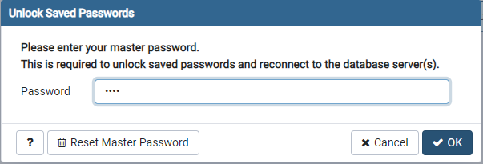

Crearemos un servidor o dentro del servidor postgres por defecto, crearemos una base de datos llamada accidentes para ello debemos seguir los siguientes pasos:  

 
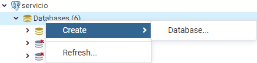

Escribimos el nombre de la base de datos  

 
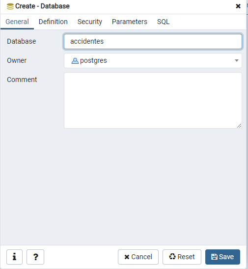

Abrimos dentro de la misma, un **Query tool** para ejecutar consultas y ejecutaremos lo siguiente  

 
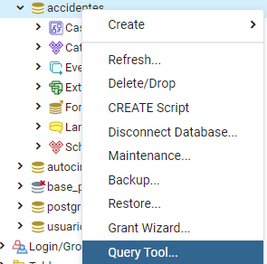

Debemos tener instalado en nuestro sistema postgis, se puede consultar en el curso de SQL  

 
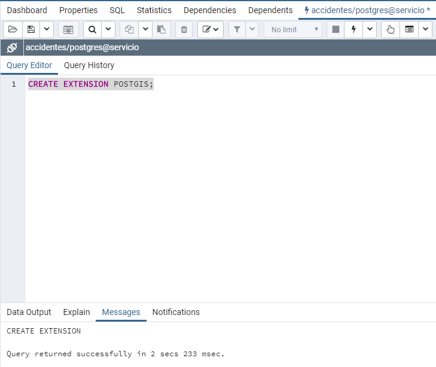

Recargamos  y veremos la extensión creada en la base de datos  

 
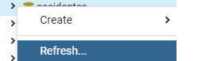

 
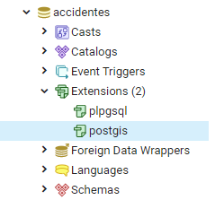

## Cargando datos de prueba a la tabla generada ## 

Una vez definida la base de datos debemos indicar los cambios con el comando **python manage.py makemigrations** el cual nos creará nuestros modelos y con **python manage.py migrate** aplicaremos los cambios sobre la base de datos.

Nos iremos a pgadmin y notaremos ahora que tenemos varias tablas, muchas de ellas son tablas que django crea por defecto para cuestiones de funcionamiento interno.  

 
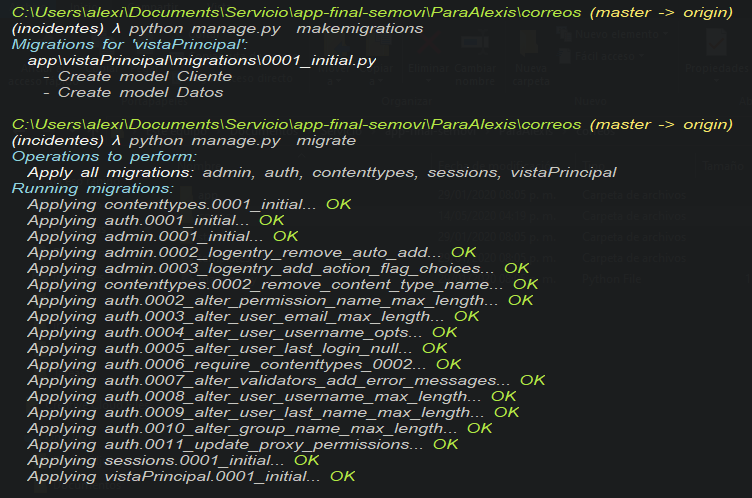

  

Seleccionamos con click derecho la tabla vistaPrincipal_datos y entramos en la pestaña de **import/export**  

 
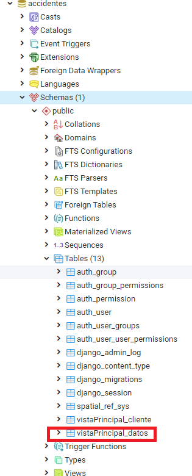

  
 

 

 
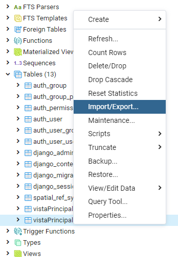

 
 Indicamos que queremos importar, seleccionamos el archivo **data_tresmeses.csv**, él cual se puede encontrar en el repositorio de github del proyecto. Indicamos el separador como una coma y el formato debemos asegurarnos que esté en csv.
 

 
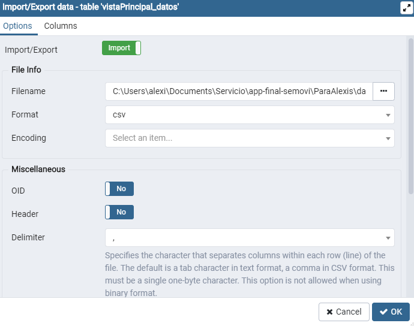

 
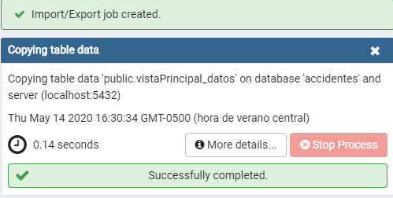

[Rutas y vistas](https://centrogeo.github.io/Geodjango_charts/GeoDjango/04-Rutas_vistas.html)
