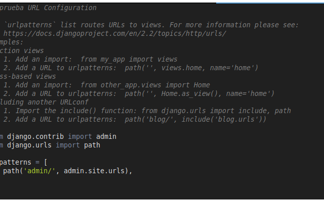
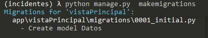

## Rutas **URL** y vistas ##  
Para ésto es importante mencionar qué es HTTP (Protocolo de Transferencia de Hipertexto), es un protocolo de transferencia de información hipermedia para Internet, diseñado para la comunicación entre navegadores y servidores web, como lo que estaremos montando es un servidor web.  
Nos iremos al archivo **views.py** dentro de app por lo que tendremos el siguiente código:  
```python
from django.shortcuts import render

# Create your views here.
```  
Importaremos las siguientes bibliotecas:  
```python
from django.shortcuts import render
import json
from geojson import Point, Feature, FeatureCollection, dump


from django.contrib.gis.geos import Polygon, Point, MultiPoint, GeometryCollection
from shapely.geometry import Point, mapping, shape
from .models import * 
from django.views.decorators.csrf import csrf_exempt

from django.http import *

from django.core.serializers import serialize
from django.core  import *
#Create your views here
```  
Entonces definiremos nuestra ruta para el index, el cual siempre funge como la página principal para ésto mencionaremos brevemente los dos métodos **HTTP** más comunes:  
*   GET El método GET  solicita una representación de un recurso específico. Las peticiones que usan el método GET sólo deben recuperar datos.    
*   POST  El método POST se utiliza para enviar una entidad a un recurso en específico, causando a menudo un cambio en el estado o efectos secundarios en el servidor.    

Procedemos a definir el index (home) de la siguiente manera:
```python
@csrf_exempt

def index(request):
    if request.method == 'GET':
        return render(request,'primeraVista/home.html')
    elif request.method == 'POST':
        
        return HttpResponseForbidden()
```  
De momento no necesitamos definir un comportamiento para el método POST hacia nuestro index por lo que  usamos 403 de http para denegar la petición, solo nos interesa mandar peticiones de tipo GET al servidor para renderizar el html de la página principal, aunque la convención es a la primera vista llamarla **index.html**, posteriormente debemos ir a nuestro archivo **urls.py** dentro de la carpeta prueba y deberá verse de la siguiente forma:  
<p align="center"> 

</p>  

Como podremos observar solo tenemos la ruta para el admin propio de django, ahora en éste arreglo debemos definir la ruta para cada ruta que tengamos en nuestro servidor django, de 
momento solo tendremos la que contendrá el mapa en leaflet, por lo que deberemos tener el siguiente código en nuestro archivo **prueba/urls.py**:

```python
from django.contrib import admin
from django.urls import path
from django.conf.urls import url ,include
from app.vistaPrincipal.urls import *
urlpatterns = [
    path('admin/', admin.site.urls),
    path('', include('app.vistaPrincipal.urls')),
]
```
Y crearemos un nuevo archivo **urls.py** dentro de la carpeta vistaPrincipal con el siguiente contenido:

```python
from django.urls import path
from django.conf.urls import url,include
from app.vistaPrincipal.views import *
urlpatterns = [
    path('',index),
]
```  
Entre las comillas debemos escribir la ruta que deberá tomar, cuando dejamos las comillas en vacío le estamos indicando que la ruta por defecto es "http://127.0.0.1:8000".  

### Nota con las rutas  
Es posible definir varios archivos  de rutas, podríamos definir para cada módulo de nuestra aplicación un **urlpattern** para manejar las vistas correspondientes,  
Previo a iniciar por primera vez nuestro servidor debemos aplicar las **migrations** las cuales son la forma en la que django aplica los cambios a los modelos definidos y con el comando **makemigrations** se crean nuevas migraciones sobre la base de datos, es por ello que deberemos ejecutar los siguientes comandos:  
**python manage.py migrate**
<p align="center"> 

</p>  

**python** **manage.py** **makemigrations**    

<p align="center"> 

</p> 

Ahora si podremos inicar nuestra aplicación para comprobar si todo va correctamente, ejecutaremos el comando **python** **manage.py** **runserver** y si vamos a nuestro navegador con la ruta "http://127.0.0.1:8000" obtendremos lo siguiente:  
<p align="center"> 

</p>  


1. [Video vistas][https://www.youtube.com/watch?v=e_aNUMCgqv0&list=PLpOqH6AE0tNgL7Jg9Kx4SdfA5_oK6292j&index=19.html]  
2. [Documentación vistas django][https://tutorial.djangogirls.org/en/django_views.html]  


[JQuery & Ajax](https://centrogeo.github.io/Geodjango_charts/GeoDjango/05-JQuery-Ajax.html)

