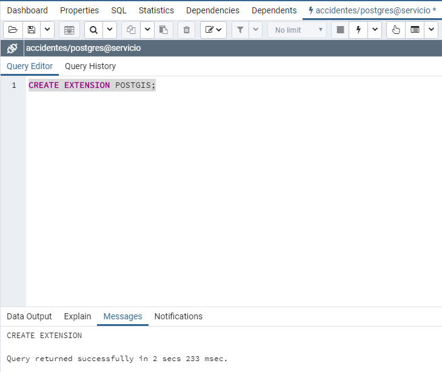
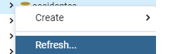

## Cargar datos de prueba a la base de datos ## 
Como pudo no haber quedado clara la configuración de la base de datos montaremos desde cero la base.  

Debemos abrir nuestro gestor PGAdmin 4 y metemos nuestras claves de inicio.

 

Crearemos un servidor o dentro del servidor postgres por defecto, crearemos una base de datos llamada accidentes para ello debemos seguir los siguientes pasos:  

 

 

 

 

 

 

