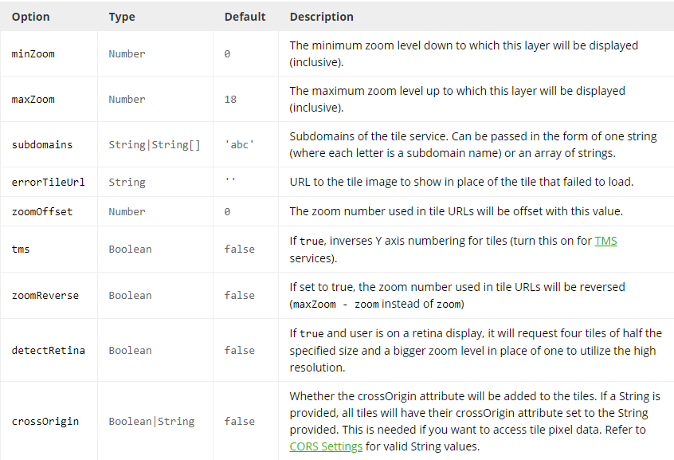

## JQuery y Ajax

**JQuery** **https://jquery.com/** es una biblioteca que nos permite manipular el HTML, el manejo de eventos, manejo de AJAX, animaciones entre otras muchas cosas, al igual que muchos otros frameworks facilitan las formas de programar en javascript.

**Ajax**  significa JavaScript asíncrono y XML (AJAX significa JavaScript asíncrono y XML), es un conjunto de técnicas usadas en el desarrollo web que permiten a las aplicaciones funcionar de forma asíncrona, ésto es que no se tenga que esperar a recibir respuesta del servidor para continuar la ejecución, se procesan las solicitudes en segundo plano.

Ahora que al menos sabemos qué es cada cosa, podemos abrir el archivo **datos.js**, haremos una prueba para cargar los datos en cuanto nuestra página se cargue a su totalidad, para ello usaremos una función muy útil de Jquery la cual es:    

```text
$(document).ready(function{...});
```

Donde function es donde definiremos el comportamiento de esa función anónima, recordemos que JavaScript permite el paso de funciones como parámetros, lo cual nos será útil más adelante, ahora dentro de ésta función debemos definir lo siguiente:  

```javascript
var testData = {
        data: []
    };
```
La variable testData es un objeto el cual tiene un atributo data de tipo array que de momento dejaremos vacio, posteriormente deberemos crear e instanciar el primer layer del mapa, un layer es una capa que podemos agregar a nuestro mapa de leaflet, recordando que podemos tener varias capas en un mapa, entonces el código quedaría de la siguiente forma: 

```javascript
 var baseLayer = L.tileLayer('https://tiles.wmflabs.org/hikebike/{z}/{x}/{y}.png', {
        Zoom: 9,
        attribution: '&copy; <a href="https://www.openstreetmap.org/copyright">OpenStreetMap</a> contributors'
      });
```  
Donde zoom es una opción que le podemos cambiar al métodod TileLayer de leaflet **puede consultar el siguiente link para más información** **https://leafletjs.com/reference-1.6.0.html#tilelayer**, TileLayer por su parte nos permita para cargar y mostrar capas en nuestro mapa, el primero parámetro del método corresponde al template del mapa (los cuales puede cambiar a consideración dependiendo el uso) se pueden encontrar algunos en el siguiente link **https://wiki.openstreetmap.org/wiki/Tile_servers**, el siguiente parámetro es un objeto con opciones para nuestro mapa, puede consultar las opciones aquí o puede dirigirse a link que se puso previamente, de momento nos quedaremos solo con zoom y attribution para dar crédito a OpenStreetMaps

<p align="center"> 

</p> 

Ahora procederemos a asignar el objeto de configuración a la variable **cfg** de la siguiente forma:   
```javascript
 var cfg = {
        // radius should be small ONLY if scaleRadius is true (or small radius is intended)
        // if scaleRadius is false it will be the constant radius used in pixels
        "radius": .008,
        "maxOpacity": .5,
        "gradient": {
          '0': 'Navy', '0.25': 'Navy',
          '0.26': 'Green',
          '0.5': 'Green',
          '0.51': 'Yellow',
          '0.75': 'Yellow',
          '0.76': 'Red',
          '1': 'Red'
        },
        // scales the radius based on map zoom
        "scaleRadius": true,
        // if set to false the heatmap uses the global maximum for colorization
        // if activated: uses the data maximum within the current map boundaries
        //   (there will always be a red spot with useLocalExtremas true)
        "useLocalExtrema": true,
        // which field name in your data represents the latitude - default "lat"
        latField: 'lat',
        // which field name in your data represents the longitude - default "lng"
        lngField: 'lng',
        // which field name in your data represents the data value - default "value"

      };
```  
Donde el campo **radius** indicará el radio de nuestro punto en el mapa, **maxOpacity** la opacidad del punto, en el objeto **gradient** la escala de colores, **scaleRadius** le indica que el punto se reescala conforme alejas el zoom en el mapa, **latfield** le indicará qué campo deberá tomar de los datos que le pasemos para la latitud, por otro lado **lngField** es para la longitud.  
Para crear nuestra capa de mapa de calor instanciamos e inicializamos la instancia con ayuda de la clase **HeatMapLayer** de la siguiente forma:  

```javascript
heatmapLayer = new HeatmapOverlay(cfg);  
```  
 
A continuación debemos inicilizar el mapa con ambas capas, **baseLayer** nos proporciona la capa que contiene el **tile server** y heatmap contiene la representación de los mapas de calor entonces procedemos a escribir el siguiente código:  

```javascript
map1 = new L.Map('map1', {
        zoomControl: true,
        minZoom: 11,
        maxZoom: 20,
        layers: [baseLayer, heatmapLayer],
        zoomAnimation: true,
        keyboard: true
      }).setView([19.40, -99.14], 11);
```

Donde el campo **zoomControl** recibe un valor booleano para indicar si se puede acercar o alejar el zoom con la rueda del ratón, **minZoom** es el mínimo zoom que puede tener el mapa y **maxZoom** es el máximo zoom que puede tener, **layers** es probablemente el campo de configuración más importante porque aquí le indicamos las capas que debe tener nuestro mapa, por lo que debe incluir la capa con los datos para el mapa de calor y el mapa base, existen otras opciones que podemos incluir en nuestro mapa las cuales se pueden consultar en el siguiente link https://leafletjs.com/reference-1.6.0.html#map-option  

Nuestra página debería verse de la siguiente forma:    
<p align="center"> 

</p> 

Ahora implementaré una solución (no única) para que por defecto, al cargar o recargar la página, se jalen todos los datos de la base y después através del combo-box podamos filtrar los datos, de momento la implementación para cargar por defecto todos los datos con python y js sería de la siguiente forma (explicaremos paso a paso):

```javascript
map1 = new L.Map('map1', {
        zoomControl: true,
        minZoom: 11,
        maxZoom: 20,
        layers: [baseLayer, heatmapLayer],
        zoomAnimation: true,
        keyboard: true
      }).setView([19.40, -99.14], 11);
```
Primero programaremos toda la parte de Javascript  

```javascript
$.ajax({
        type: "GET",
        url: 'data/',
        data: {
          'val': '2018'
        },
        dataType: 'json', 
        async: true,

        ...});
```
Iniciamos una petición de ajax con jquery, le definimos el método http que usaremos, en nuestro caso nos interesa obtener información del servidor, por lo que el método ideal es **GET**, le pasamos el url al que debe hacer la petición en nuestro caso **data/**, le indicamos que el tipo de dato que queremos es un **JSON** y la petición que sea asíncrona, es decir que si le es posible continue con la ejecución mientras espera la respuesta del servidor ésto es por temas de experiencia de usuario.  
Ahora que logramos hacer nuestra petición debemos usar lo que se conoce como **promesas** de js, ésto podemos verlo como un objeto que representa éxito o fracaso en la petición asíncrona que hemos realizado con ajax, siempre se ejecutan terminando las funciones anteriores, entonces si todo sale bien y recibimos los datos usaremos una promesa para manejar la respuesta del servidor que debiera ser un objeto JSON.  
La sintaxis es la siguiente:  
```javascript
$.ajax({
        ...

        success:function(respuesta){
          //Uso de respuesta  
        }
});
```

Solo para un mejor entendimiento voy a aclarar, directamente podríamos pasar el json como los datos para el mapa pero en particular nos interesa filtrar algunos campos por ende será un poco repetitivo y antes iremos a python a programar la parte del backend donde se procesará la petición, por lo que abriremos nuevamente el archivo **app/vistaPrincipal/views.py**

```python
    #código previo
@csrf_exempt
def data(request):
    if request.method == 'GET':
        val = request.GET.get('val')
        #podemos imprimir el valor para debug solamente, en producción por buenas prácticas de programación no hay que dejar print's 
        print(val)
        if(val != "2018"):    
            dataAux = serializers.serialize("geojson", Datos.objects.filter(fecha__month=val))
            return  HttpResponse(dataAux)
        else:
            dataAux = serializers.serialize("geojson", Datos.objects.all())
            return  HttpResponse(dataAux)
    elif request.method == 'POST':
        return HttpResponseForbidden()
```  

Como podremos observar, solo estaremos permitiendo peticiones de tipo **GET** dado que no tiene sentido recibir **POST**, el usuario solo quiere consultar datos, por tanto no modificar el estado del servidor, así que usamos 403 de HTTP forbidden como lo podemos ver en el código de arriba. Ahora bien, la lógica nos lleva a dos casos, si el valor buscado por el usuario corresponde a **2018** u otro caso, por ejemplo, **Enero** independientemente del valor, lo único que hay que hacer es un query a la base de datos pero por temas de seguridad se recomienda hacerlo através del ORM y no de ejecuciones directas, ésto con el fin de evitar **SQLInjection**. 

```python
            #... 
            dataAux = serializers.serialize("geojson", Datos.objects.filter(fecha__month=val))
            return  HttpResponse(dataAux)
            # else:
            dataAux = serializers.serialize("geojson", Datos.objects.all())
            return  HttpResponse(dataAux)
```

La sintaxis es Modelo.objects.metodo(parametros), para el primer caso como nos interesa consultar los datos de un determinado mes, debemos aplicar un filtro con .filter() y los parámetros deben corresponder a los atributos de la tabla en la base de datos, en nuestro caso es fecha (el cual es el atributo de tipo date en django) es un equivalente a hacer ésto en postgres:  


```sql
---dataAux = serializers.serialize("geojson", Datos.objects.filter(fecha__month=val))

select * from "vistaPrincipal_datos" where date_part('month', fecha) = mesFiltrado;
```
Y por otro lado el equivalente al caso 2 sería el siguiente:  

```sql
---dataAux = serializers.serialize("geojson", Datos.objects.all())
select * from "vistaPrincipal_datos";
```
Cuando obtenemos los datos ahora hay que serializarlos, para ésto nos axiliaremos de la clase serializer de django  **https://docs.djangoproject.com/en/3.0/ref/contrib/gis/serializers/** donde el primer parámetro indica a qué tipo de formato queremos serializar, en nuestro caso es json (o geojson en particular). Una vez teniendo serializando los datos debemos regresarlos a JavaScript para que pueda seguir con la ejecución.

```javascript
$.ajax({
        ...

        success:function(respuesta){
          responseFeatures = respuesta['features']
        }
});
```
Como nos interesa guardar los datos para las gráficas, aunque no es la única forma de hacerlo guardaremos en arreglos auxiliares, para recorrer el objeto json usaremos la estructura **for-each** de js  


```javascript
$.ajax({
        ...

        success:function(respuesta){
          responseFeatures = respuesta['features']
	  geoms = []
	  props = []
	  element = []
	  responseFeatures.forEach(element => geoms.push(element.geometry) && props.push(element.properties["delito"]) && 
	  entidad.push(element.properties["identidad"]));
        }
});
```
Lo que hicismo fue iterar sobre cada elemento dentro de las responseFeatures del geojson y guardamos en el respectivo arreglolos datos. Ahora, guardaremos las coordenadas de los puntos en otro arreglo
```javascript
$.ajax({
        ...

        success:function(respuesta){
          responseFeatures = respuesta['features']
	  geoms = []
	  props = []
	  element = []
	  responseFeatures.forEach(element => geoms.push(element.geometry) && props.push(element.properties["delito"]) && 
	  entidad.push(element.properties["identidad"]));
	  auxPuntosFinal = []
          geoms.forEach( function(element) {
            auxPuntos = []
            auxPuntos.push(element.coordinates[0][1])
            auxPuntos.push(element.coordinates[0][0])
            auxPuntosFinal.push(auxPuntos)
          });
	  
        }
});
```
Iteramos sobre las geometrías para las coorendas de cada punto y lo guardarmos como sub-arreglos de longitud 2 para posteriormente iterar sobre el arreglo de arreglos resultante y obtener la latitud y longitud  

```javascript
$.ajax({
        ...

        success:function(respuesta){
          responseFeatures = respuesta['features']
	  geoms = []
	  props = []
	  element = []
	  responseFeatures.forEach(element => geoms.push(element.geometry) && props.push(element.properties["delito"]) && 
	  entidad.push(element.properties["identidad"]));
	  auxPuntosFinal = []
          geoms.forEach( function(element) {
            auxPuntos = []
            auxPuntos.push(element.coordinates[0][1])
            auxPuntos.push(element.coordinates[0][0])
            auxPuntosFinal.push(auxPuntos)
          });
	  datos = []
          auxPuntosFinal.forEach( function(element) {
              dataAux = {
                         lat: element[0],
                         lng:element[1]
                       }
              datos.push(dataAux)
          });
	  
        }
});
```
Ahora que tenemos los datos para el mapa de calor (las coordenadas) se las asignaremos a nuestro objeto testData el arreglo datos de la siguiente forma:  


```javascript
$.ajax({
        ...
	varData = datos
        
});
```
Y le asignamos los puntos a nuestro mapa de calor a través del método setData()  
```javascript
$.ajax({
        ...
	heatmapLayer.setData(testData);
        
});
```

Ahora le pasaremos los datos para generar las gráficas, mandamos a llamar la función graficar(a,b) con los siguientes parámetros   

```javascript
$.ajax({
        ...
	 graficar(entidad, props)
        
});
```

Ahora debemos tener lo siguiente en nuestro mapa:  

<p align="center"> 

</p>
