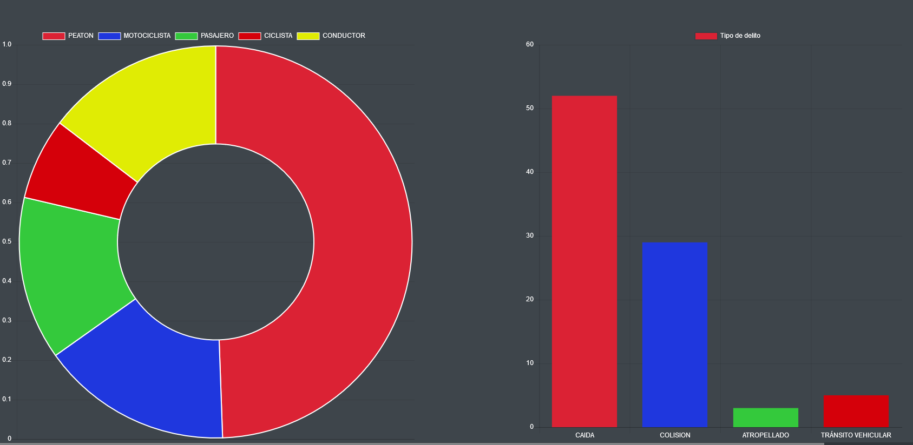

## Gráficas con Chart.js ## 
Notemos que en nuestro html tenemos  

```html

      <div class="chart-container" >
        <canvas id="myChartGraph" width="100" height="100" style="margin-left:100px;"></canvas> 
        <canvas id="myChartGraph1" width="100" height="100" style="margin-left:200px;"></canvas> 
       </div> 
```  
Tenemos dos canvas donde se dibujarán nuestras gráficas, ahora debemos inicializarlas en el código JS.  

```javascript
    var myChart;
    var myChart1;
    function graficar(datos, delito){
      var jsonData = JSON.stringify(datos)
      var delitoData = JSON.stringify(delito)


      var ctx = document.getElementById("myChartGraph").getContext("2d")
      var ctx1 = document.getElementById("myChartGraph1").getContext("2d")

      if(myChart != null && myChart1 != null){
        myChart.destroy();
        myChart1.destroy();
      }
    //... 
     }  
```    
Debemos crear la variable a la cual asignar los canvas, dado que estamos recibiendo dos arreglos usamos la función de JS JSON.stringify() para convertir el arreglo en una cadena, después usamos el método document.getElementById() para regresar un objeto de tipo **Element** que representa el elemento cuyo id coincide con la cadena y getContext es un método de canvas de html para devolver un "contexto de dibujo" y con 2d le estamos indicando que el tipo de contexto es de dos dimensiones. Con la estructura **if** checamos si ya estaba previamente inicializada y de ser así la destruimos para poder volver a usar el canvas y  que los datos se sobreescriban de forma correcta.  
```javascript
//...
//Indicamos que la letra en las gráficas sea blanca
Chart.defaults.global.defaultFontColor = 'white';
```  
Ahora vamos a filtrar los datos con ayuda de una estructura **switch-case** (No es la única forma de hacerlo pero es intuitiva)  

```javascript
      //...
      var numPeaton = 0;
      var numMoto = 0;
      var numPasajero = 0;
      var numCiclista = 0;
      var numConductor = 0;
      for (var i = 0; i <= datos.length - 1; i++) {
        console.log(datos[i])
        switch(datos[i]){
          case "PEATON":
              numPeaton +=1;
            break;
          case "MOTOCICLISTA":
              numMoto+=1;
              break;
          case "PASAJERO":
            numPasajero+=1;
            break;
          case "CICLISTA":
            numCiclista+=1;
            break;
          case "CONDUCTOR":
            numConductor+=1;
            break;
          default:
            break;
          

        }
      }
      var atropellado = 0
      var colision = 0
      var caida = 0
      var transito = 0
      for (var i = 0; i <= delitoData.length - 1; i++) {
        switch(delito[i]){
          case "HOMICIDIO CULPOSO POR TRÁNSITO VEHICULAR (CAIDA)":
              atropellado +=1;
            break;
          case "HOMICIDIO CULPOSO POR TRÁNSITO VEHICULAR (COLISION)":
              colision+=1;
              break;
          case "HOMICIDIO CULPOSO POR TRÁNSITO VEHICULAR (ATROPELLADO)":
              caida+=1;
            break;
          case "HOMICIDIO CULPOSO POR TRÁNSITO VEHICULAR":
              transito+=1;
            break;
          
          default:
            break;
          

        }
      }
	...
```  
Tenemos el número de ocurrencia de cada cadena con lo cual ya solo debemos crear nuestras gráficas con éstos datos de la siguiente forma:  

```javascript
    //... 
    myChart = new Chart(ctx, {
          type:"doughnut", //Indicamos el tipo de gráfica
          data: {
            labels:['PEATON','MOTOCICLISTA','PASAJERO','CICLISTA','CONDUCTOR'], //Damos las cabezeras a la gráfica
            datasets:[{
              label:'Tipo de Entidad',
	      //Aquí le pasamos los datos  numéricos que conseguimos previamente
              data:[numPeaton, numMoto, numPasajero, numCiclista, numConductor],
              //indicamos los colores para cada 
	      backgroundColor:[ 
                'rgb(219,34,52)',  
                'rgb(31,55,222)',
                'rgb(52,201,60)',
                'rgb(213,0,10)',
                'rgb(224,236,4)',
              ]
            }],
            },
	  //Aquí indicamos toda la configuración opcional de la gráfica
          options:{
            //Ajustamos la escala
	    scales:{
              yAxes:[{
                ticks:{
	          //indicamos la orientación
                  beginAtZero:true
                }
              }]
            },
	    //Le indicamos que el canvas sea responsivo 
            responsive:true
          }
      });
      //Con ésta función le decimos que se actualice el canvas con la nueva configuración
      myChart.update();
      
      //Éste canvas es análogo
      myChart1 = new Chart(ctx1, {
          type:"bar",
          data: {
            labels:['CAIDA','COLISION','ATROPELLADO','TRÁNSITO VEHICULAR'],
            datasets:[{
              label:'Tipo de delito',
              data:[caida, colision,atropellado,transito],
              backgroundColor:[
                'rgb(219,34,52)',
                'rgb(31,55,222)',
                'rgb(52,201,60)',
                'rgb(213,0,10)',
                'rgb(224,236,4)',
              ]
            }],
            },
          options:{
            scales:{
              yAxes:[{
                ticks:{
                  beginAtZero:true
                }
              }]
            },
            responsive:true
          }
      });
      myChart1.update();
      

     }
   }
   //...
```
Con ésto obtendriamos lo siguiente en nuestra página:   

<p align="center"> 

</p> 

1. [Documentación Charts JS](https://www.chartjs.org/samples/latest/) 
2. [Charts Django](https://simpleisbetterthancomplex.com/tutorial/2020/01/19/how-to-use-chart-js-with-django/)  
3. [Video Django ChartJS](https://www.youtube.com/watch?v=B4Vmm3yZPgc/) 
4. [Charts JS desde python](https://pypi.org/project/django-chartjs/) 

[Formularios](https://centrogeo.github.io/Geodjango_charts/GeoDjango/07-Formularios.html)

