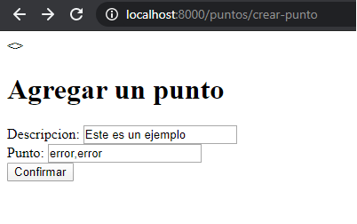

## Formularios para agregar datos a una tabla ##
Veremos cómo crear un formulario básico para cargar puntos a una tabla para ello nos iremos a nuestra clase **app/primeraVista/models.py**, crearemos un modelo llamado TablaPuntosEjemplo de la siguiente forma:  


```python
class TablaPuntosEjemplo(geomodels.Model):
	"""docstring for TablaPuntosEjemplo"""
	id_punto = models.AutoField(primary_key=True)
	descripcion_punto = models.CharField(max_length=200)
	coordenadas_punto = geomodels.PointField(srid=4326, default=None, null=True)

```  
Con lo que tenemos un **id_punto autoincrementable**, una **descripcion_punto** de nuestro punto donde podemos incluir alguna referencia
y por último un atributo llamado **coordenadas_punto** en el cual agregaremos una geometría de tipo punto la cual estará el sistema de referencia **4326** puede ser nula y por defecto es de tipo None.  
Recordemos que ésto nos hará el mapeo a una tabla en postgres, por lo cual debemos aplicar los comandos de **makemigration** y **migration**.  
<p align="center"> 

</p>  
<p align="center"> 

</p>

Antes de crear la vista debemos crear el formulario para agrear el punto, para ello crearemos un archivo dentro de la carpeta **app/primeraVista/** , con lo que tendremos la estructura:  
```
Geodjango_charts/
└── prueba/
   ├── manage.py
   ├── app/
       └── vistaPrincipal/
          └── migrations/
          └── admin.py
          └── app.py
          └── models.py
          └── tests.py
          └── views.py
          └── urls.py
	  └── forms.py
       └── __init__.py
   ├── prueba/
       └── __init__.py
       └── __pycache__
       └── settings.py
       └── urls.py
       └── wsgi.py
    ├── templates/
      └── primeraVista
        └──home.html
    ├── static/
      └── img/
      └── js/
        └──datos.js
        └──heatmap.js
        └──leaflet-heatmap.js
      └── css/
        └──mapa.css
```    
Dentro de nuestro archivo **forms.py** tendremos el siguiente código:  

```python   
from django.contrib.gis import forms
from .models import * 
from django.contrib.gis.geos import GEOSGeometry
import re
class AddPointForm(forms.Form): 
    descripcion = forms.CharField(max_length=200)
    punto = forms.CharField(max_length=200)
    def clean_punto(self):
        coordinates = self.cleaned_data['punto']
        latitude, longitude = coordinates.split(',', 1)
        coord_expr = re.compile('^[-]*[0-9]+.[0-9]+$')
        if((latitude == None or longitude == None) or not(coord_expr.match(latitude) and coord_expr.match(longitude))):
            print("entra al error")
            raise forms.ValidationError("No se puede generar un punto con longitud o latitud inválida")
        else:

        	return GEOSGeometry('POINT('+longitude+' '+latitude+')')
	

```

Donde cada atributo denotará un campo del formulario en el html, entonces por ejemplo descripción al igual que en el modelo, será un atributo del formulario de tipo caracter de longitud 200, por otro lado punto será un atributo de tipo cadena a diferencia del atributo correspondiente a punto en el modelo. En éste punto podrías preguntarte ¿no deben coincidir los tipos de dato del formulario con los del modelo?, en principio sí, pero en la realidad es que pueden no coincidir pero debemos hacer unos ajustes para que todo funcione correctamente.  

Como podemos observar tenemos un método **clean_punto** donde asignamos a **coordinates** el valor que reciba de el campo 'punto' del formulario, después parseamos la cadena a través de la coma ',' y con un max_split de 1, es decir solo debe dividir en dos el valor separado por coma; así una vez tengamos éstos valores asignanos haremos uso del API GEOSGeometry que se encargará de generar la geometría con los valores de latitud longitud que le estemos pasando.  


Ahora creemos la vista correspondiente, pero lo haremos de una forma equivalente para cubrir ambas en el curso, nos iremos al archivo **app/primeraVista/views.py**.  

Importamos las views de django **from django.views import View**, con ésto podemos hacer lo que se conoce **Clases como vistas** en lugar de lo que hicimos previamente que es conocido como **Funciones como vistas**, en otras palabras, ahora nuestras vistas pasan de ser funciones a clases, y al ser clases heredan todo lo de **programación orientada a objetos** de python (referencia ). Por otro lado también debemos importar el formulario que creamos previamente **from .forms import  AddPointForm** asignando eso al contexto, por último debemos renderizar el template crear_punto.html con el contexto que hemos definido previamente (el form).

```python   
#...
class AgregarPuntos(View):
    def get(self, request):
        form = AddPointForm()
        context = {"form": form}
        return render(request, 'primeraVista/crear_punto.html', context)  
    def post(self, request):
        form = AddPointForm(request.POST, request.FILES)
        print(form)
        if not form.is_valid():
            context = {"form": form}
            return render(request, 'primeraVista/create_point.html', context)
            
        TablaPuntosEjemplo.objects.create(
            descripcion_punto = form.cleaned_data["descripcion"],
            coordenadas_punto = form.cleaned_data["punto"],
            
        )
        return render(request, 'primeraVista/exito.html')
```  

Explicaremos paso a paso el código de arriba, primero al igual que en las funciones vistas previamente, necesitaremos definir las funciones get y post (al menos), empezando por **get** tenemos que instanciar el formulario que creamos previamente, asignarlo al contexto y aplicar **render** sobre el html y ese contexto para mostrar el formulario en el navegador.  
Por otro lado para el método **post** debemos instanciar el formulario con los datos del **request** y nos interesa verificar si contiene algún error en la entrada para controlar y mitigar potenciales errores, por tanto hacemos uso del método **form.is_valid()** el cual verificará si el formulario contiene errores o en otro caso es válido, pero como queremos cazar errores entonces usaremos la negación lógica de la condición qudeando de la siguiente forma **if not form.is_valid():** la cual nos garantiza que el código del interior de ese bloque se ejcutará en caso de que el form contega un error. Al volver a hacer render sobre el mismo html, con el contexto nuevo que ahora sabemos contiene un error, se desplegará un mensaje correspondiente al error, ésto surge de checar en la clase AddPointForm si la latitud o longitud es inválida, ejemplo:  

<p align="center"> 

</p>  
<p align="center"> 

</p> 
En otro caso, si ingresamos un punto válido obtendremos lo siguiente:  
<p align="center"> 


</p> 
.  
<p align="center"> 

</p>  

**Nota, no funcionará todavía puesto que no hemos definido las rutas, pero lo cubriremos más adelante**  
Ahora bien por último una vez que el form sea válido habremos generado nuestra geometría, y debemos usar el ORM
para crear el objeto de la clase **TablaPuntosEjemplo** que corresponde a la parte dentro del método post  
```python
TablaPuntosEjemplo.objects.create(
            descripcion_punto = form.cleaned_data["descripcion"],
            coordenadas_punto = form.cleaned_data["punto"],
            
        )
        return render(request, 'primeraVista/exito.html')
```  
donde estaremos guardando el elemento en nuestra tabla y  renderizando un html con el mensaje de éxito.  

Por último para ésta parte solo nos queda **definir las rutas y los html para que funcione como las imágenes de ejemplo**, por lo cual abriremos el archivo **app/primeraVista/urls.py** el cual quedará de la siguiente forma:  

```python
from django.urls import path
from django.conf.urls import url,include
from app.vistaPrincipal.views import *
from django.views import View
from app.vistaPrincipal import views

app_name = "app"

urlpatterns = [
    path('',index),
    path('data/', data),
    path("puntos/crear-punto", views.AgregarPuntos.as_view(), name="crear_punto"),
]
```  

Como podremos observar tenemos dos imports nuevos, que corresponden a las bibliotecas o APIS que debemos llamar para poder trabar con nuestras clases como vistas, y es importante  notar  que agregamos un path a nuestro **urlpatterns**, distinto a los anteriores, en el primer parámetro estamos definiendo la ruta para la clase, es decir, la que debemos escribir en el navegador, el segundo parámetro nos ayuda a decirle a **djando** que queremos cargar una clase como vista con ayuda del método **as_view()** de views y el último parámetro es una etiqueta con la cual vamos a acceder a esa ruta desde el html.  
Para un mejor ahora veremos los html, con lo cual debemos crear 2 nuevos dentro de nuestra carpeta **templates/primeraVista**, uno lo llamaremos **crear_punto.html** y otro **exito.html**, primero analizemos **crear_punto.html**:  

<p align="center"> 

</p>  

Aquí solo definiremos un formulario a través de la etiqueta de html <form></form>, en la cual podremos observar que tiene action="./crear-punto" en el cual debemos indicarle la ruta que debe tomar el form para enviar la petición POST, en method="POST" le estamos indicando bajo qué método http enviará la petición como vimos previamente en el curso.  
Ahora con ayuda de un for iteramos el form que enviamos como context, en el cual indicamos el label_tag que corresponde al nombre del atributo dentro el form, el campo donde se introducirá y el mensaje de error en caso de existir. 

por otro lado solo necesitaremos crear un html llamado **exito.html**

```html

	<!DOCTYPE html>
	<html>
	<head>
		<title>Éxito</title>	
	</head>
	<body>
		<h1>Punto agregado correctamente</h1>
		
	</body>
	</html>
``` 

Así, tendremos nuestro formulario para agregar puntos a nuestra tabla de puntos.
Agregaremos un campo adicional para cargar imágenes por ejemplo, antes que nada, para hacer ésto debemos instalar a nuestro entorno la bibliotecta llamada **pillow** que sirve para el manejo y procesamiento de imágenes digitales en python.  
Para ello debemos escribir en nuestra terminal lo siguiente:  

<p align="center"> 

</p>   
Una vez instalado pillow, nos iremos a nuestro archivo **models.py** y agregaremos el campo de tipo imagen con lo que nuestro código quedaría de la siguiente forma:  

```python
from django.db import models
from django.contrib.gis.db import models as geomodels
from django.contrib.gis.db.models import PointField


class Datos(models.Model):
    id = models.IntegerField(primary_key=True)    	
    geom = geomodels.MultiPointField()
    field_1 = models.IntegerField()
    id_ssc = models.IntegerField()
    id_pgj = models.IntegerField()
    delito = models.CharField(max_length = 100)
    tipo_evento = models.CharField(max_length = 100)	
    fecha = models.DateTimeField()	
    identidad = models.CharField(max_length = 100)

def image_directory_path(instance, filename):
    """El directorio donde se guardará la imagen"""
    return f"sismo/{filename}"

class TablaPuntosEjemplo(geomodels.Model):
	"""docstring for TablaPuntosEjemplo"""
	id_puntos = models.AutoField(primary_key=True)
	descripcion_punto = models.CharField(max_length=200)
	coordenadas_punto = geomodels.PointField(srid=4326, default=None, null=True)
	imagen_punto = models.ImageField(upload_to=image_directory_path, default=None)
    
```  
Como podremos observar hay cosas nuevas que explicaremos a continuación, empezando por la definición de la función **directorio_imagenes** la cual es una función donde indicamos la carpeta donde se guardarán las imágenes de los puntos, en el **return** le estamos indicando como sufijo la cadena **sismo/imagenes/** la cual explicaremos más adelante y como nombre del archivo le dejaremos de  momento el nombre que traiga que por defecto la imagen al cargarse, aquí podriamos darle una regex para renombrarla.  
Por otro lado, agregamos un campo llamado imagen_punto el cual es una opción de los modelos de django para cargar imágenes como atributos, notemos que tiene un key_word llamado **upload_to** es ahí donde indicamos el directorio a donde guardar la imagen.  

Ahora debemos configurar nuestro proyecto para indicarle la ruta de los archivos dinámicos, tales como las imágenes, entonces vamos a abrir nuestro archivo **urls.py** pero de la carpeta prueba y agregaremos la siguiente línea:  
```python
from django.contrib import admin
from django.urls import path
from django.conf.urls import url ,include
from app.vistaPrincipal.urls import *
from django.conf.urls.static import static
from django.conf import settings

urlpatterns = [
    path('admin/', admin.site.urls),
    path('', include('app.vistaPrincipal.urls')),
] + static(settings.MEDIA_URL, document_root=settings.MEDIA_ROOT)
```  
Ahora abrimos nuestro archivo **settings.py** y agregamos 

<p align="center"> 

</p> 

por último crearemos una carpeta **media** a la altura del archivo **manage.py** y posteriormente dentro de **media** creamos una carpeta llamada **sismos**


<p align="center"> 

</p> 

Ejecutamos el comando **python manage.py makemigrations**. Nos agregará el campo a nuestra tabla y solo nos quedará aplicar los cambios con **python manage.py migrate**.  

En nuestro formulario agregaremos el campo para la imagen, para ello iremos al archivo **forms.py**

```python
"""points forms."""
# Django
from django.contrib.gis import forms
from .models import * 
from django.contrib.gis.geos import GEOSGeometry
import re
class AddPointForm(forms.Form): 
    descripcion = forms.CharField(max_length=200)
    punto = forms.CharField(max_length=200)
    imagen = forms.ImageField()

    def clean_punto(self):
        coordinates = self.cleaned_data['punto']
        latitude, longitude = coordinates.split(',', 1)
        latitude = latitude.strip()
        longitude = longitude.strip()
        coord_expr = re.compile('^[-]*[0-9]+.[0-9]+$')
        if((latitude == None or longitude == None) or not(coord_expr.match(latitude) and coord_expr.match(longitude))):
            print("entra al error")
            raise forms.ValidationError("No se puede generar un punto con longitud o latitud inválida")
        else:

        	return GEOSGeometry('POINT('+longitude+' '+latitude+')')
```


<p align="center"> 

</p>   


1. [Documentación GeoDjango Forms](https://docs.djangoproject.com/en/3.0/ref/contrib/gis/forms-api.html)      
2. [Documentación Django Forms](https://docs.djangoproject.com/en/3.0/topics/forms.html)    
3. [Ejemplo Django Form ](https://tutorial.djangogirls.org/en/django_forms/.html)    
4. [Video ejemplo Django Form ](https://www.youtube.com/watch?v=6oOHlcHkX2U.html)    
5. [Video ejemplo Django Form ](https://www.youtube.com/watch?v=B3oQIx1W8PA.html)    

[Django shell](https://centrogeo.github.io/Geodjango_charts/GeoDjango/08-Django-shell.html)


