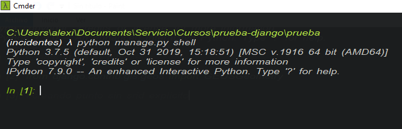
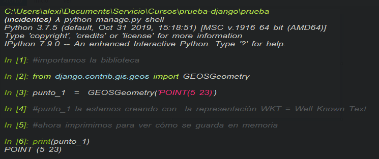
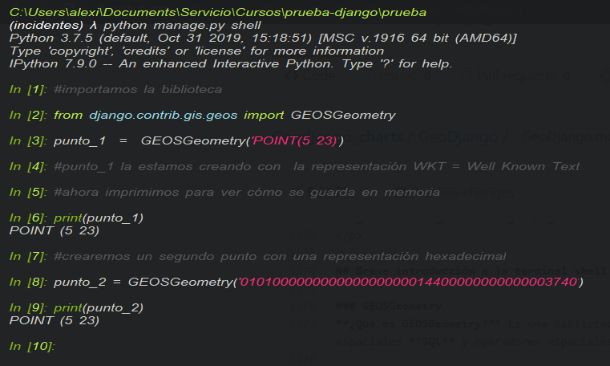
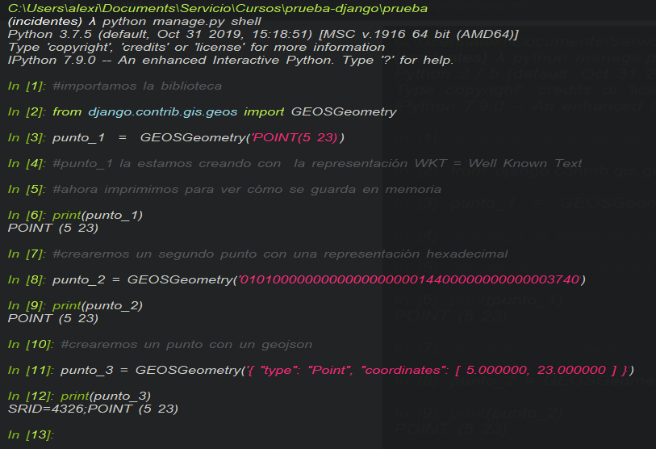
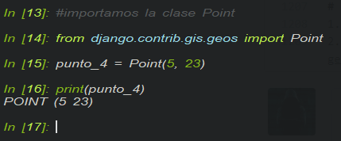
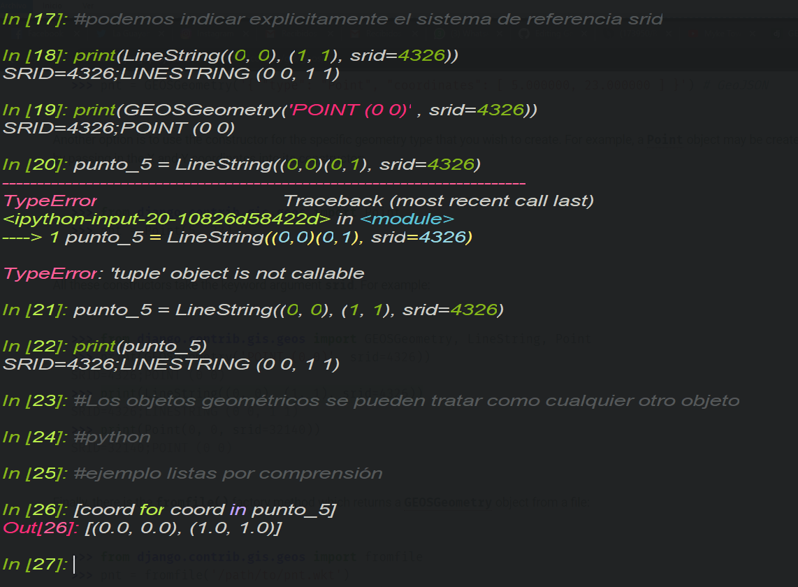
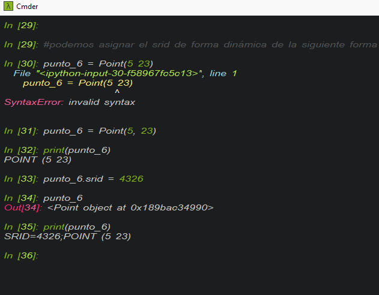

## Breve introducción a la terminal shell 

### GEOSGeometry  
**¿Qué es GEOSGeometry?** Es una biblioteca de código abierto que implementa las funcionalidades de OpenGIS para el manejo de predicados espaciales **SQL** y operadores espaciales.  

Antes de pasar al manejo en django, probaremos crear unas instancias brevemente en la terminal interactiva de python, para ello con el comando **python manage.py shell** abriremos una terminal.
Nuestra terminal deberá verse de la siguiente forma: 

 

  

Crearemos nuestra primer geometría con representación **wkt**  

 

  

Así también podemos usar otras representaciones como la codificación **hexadecimal, geojson** , etc. Recordemos que el sistema hexadecimal es un sistema de numeración posicional base 16, es un sistema muy importante en cuanto al manejo interno de la memoria de la computadora aunque ese tema no será abordado a profundidad.  

 

Ahora con representación geojson  

 

  

Otra forma de crear objetos es usar directamente los constructores (un constructor podemos pensarlo como un molde para crear objetos de cierto tipo) para crear objetos geométricos específicos, por ejemplo:  

 

  

Podemos pasar explicitamente el sistema de referencia en los parámetros, además, los objetos geométricos pueden ser tratados e iterados como cualquier otro objeto en python.  

 

  

Las **listas por comprensión** es una forma abreviada que nos ofrece python para hacer algo con los objetos de una estructura de datos como listas o diccionarios.  
En el ejemplo estamos imprimiendo la coordenada por cada coordenada en el LineString, éste, es un objeto iterable, es decir que podemos recorrer sus elementos.

 

  

De igual forma podemos asignar como en la imagen el srid de forma dinámica, ésto nos puede servir para asignar posteriormente el sistema de referencia.   

1. [Documentación shell][https://docs.djangoproject.com/en/3.0/ref/contrib/gis/tutorial/]      

[Agregar datos leaflet](https://centrogeo.github.io/Geodjango_charts/GeoDjango/09-Datos-Leaflet.html)
