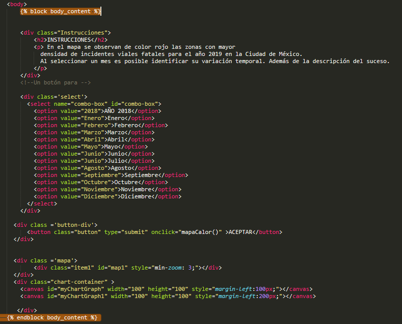
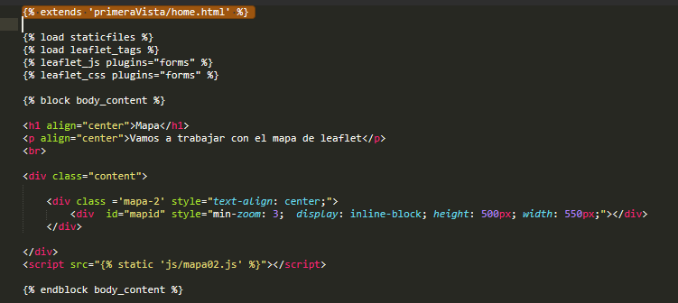
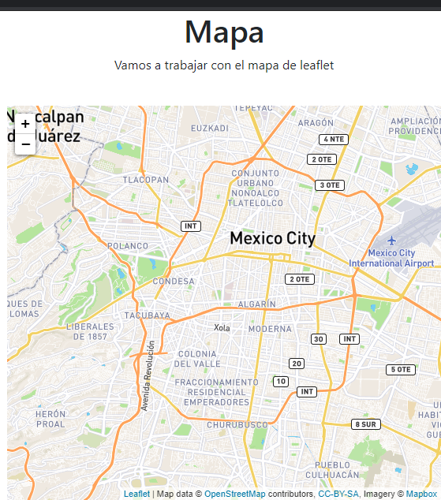
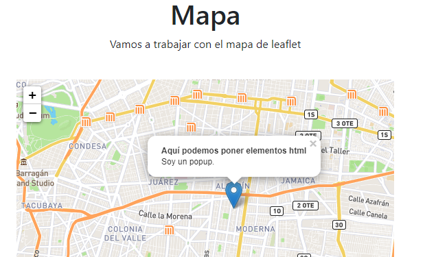
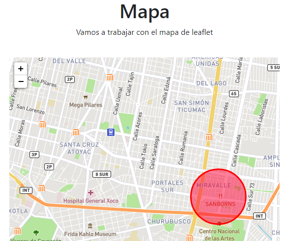
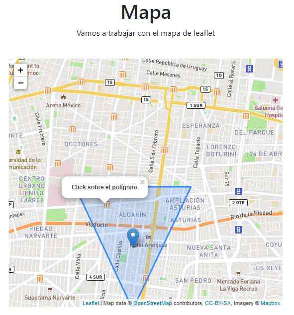
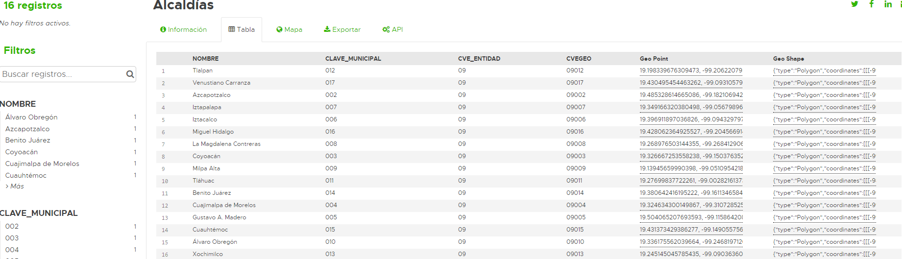
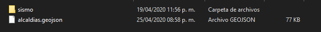
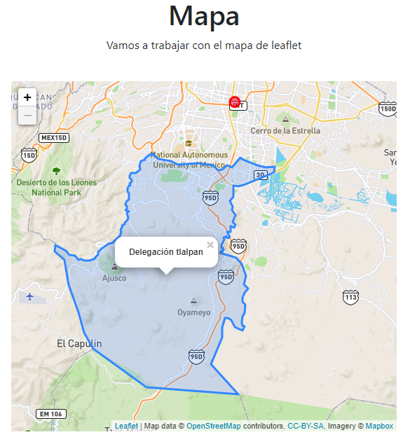
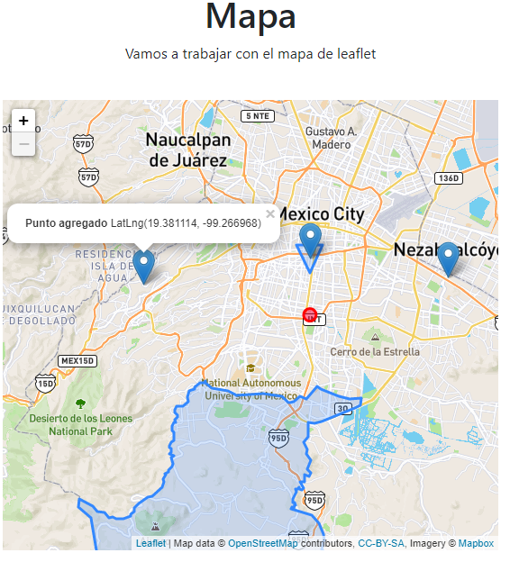

## Agregando datos desde mapa leaflet

Como última sección del curso, veremos brevemente cómo cargar un mapa leaflet y meterle distintos tipos de geometrías desde JavaScript. 

Primero vamos a crear nuestra vista basada en clase **Mapa02** para ello abriremos nuestro archivo **primeraVista/views.py** y agregaremos la siguiente clase:
```python  
#código previo  
class Mapa02(View):
    def get(self, request):      
        return render(request, 'primeraVista/mapa_02.html')
```  

Una vez agregado, nos vamos a **urls.py** y agregaremos la ruta (**path**) con lo que nuestro **urlpatterns** queda:

```python
urlpatterns = [
    path('',index),
    path('data/', data),
	path("puntos/crear-punto/", views.AgregarPuntos.as_view(), name="crear_punto"),
	path("mapa2/", views.Mapa02.as_view(), name="mapa_02"),
]
```
Con ésto ya solo nos queda crear nuestro template para el nuevo mapa pero antes debemos cambiar algunas cosas en nuestro archivo **home.html**  

<p align="center"> 

</p>  

Notemos que debemos agregar las líneas sombreadas, ésto es algo que nos proporciona django para "agrupar" contenidos dentro de nuestro html, en éste caso estamos indicando que lo que está dentro de **body_content** sobreescribirá el body dentro de otros archivos html, es una forma de evitar estar definiendo mismo código en distintos templates, una vez agregada esa línea podemos pasar a nuestro template **mapa_02.html**.  


<p align="center"> 

</p>  

Para extender un archivo usaremos el tag sombreado, ahí indicamos el template que queremos extender y por consiguiente se nos cargarán todos los imports del **home** cuando hagamos ésto debemos tener cuidado de la redundancia y que probablemente extendamos algún archivo que tal vez ya no nos interese, sin embargo de momento omiteremos esos detalles.  

<p align="center"> 

</p>    

```html
<div class="content">

	<div class ='mapa-2' style="text-align: center;">
        <div  id="mapid" style="min-zoom: 3;  display: inline-block; height: 500px; width: 550px;"></div>    
    </div>
	
</div>

```
Omitiremos la explicación de la estructura html puesto que ya cubrimos esa parte previamente y nos enfocaremos al archivo **JS**.
Creamos nuestro archivo **JS**  **mapa02.js** y  ya no usaremos  **$(document).ready(function()...** de Jquery, simplemente definiremos nuestro mapa de la siguiente forma:  

```javascript
map2 = new L.Map('mapid', {
        center: new L.LatLng(19.27, -99),
        zoomControl: true,
        minZoom: 11,
        maxZoom:20,
        layers: []
      }).setView([19.40, -99.14], 11);
```  

Aquí solo estamos dándole la configuración inicial, lo centramos en la **CDMX**, le damos un zoom máximo y mínimo, le damos la capacidad de controlar el zoom, no le damos capas y centramos la vista. Ésto lo habíamos hecho previamente, ahora agreguemos una capa con un tile personalizado **crétidos a maxbox por el tile**   

[mapbox] (https://www.mapbox.com/?utm_medium=sem&utm_source=google&utm_campaign=sem|google|brand|chko-googlesearch-pr01-mapboxbrand-br.exact-intl-landingpage-search&utm_term=brand&utm_content=chko-googlesearch-pr01-mapboxbrand-br.exact-intl-landingpage-search&gclid=EAIaIQobChMIi_CetKGF6QIVg__jBx0uvgkoEAAYASAAEgIMH_D_BwE)


```javascript
L.tileLayer('https://api.mapbox.com/styles/v1/{id}/tiles/{z}/{x}/{y}?access_token=pk.eyJ1IjoibWFwYm94IiwiYSI6ImNpejY4NXVycTA2emYycXBndHRqcmZ3N3gifQ.rJcFIG214AriISLbB6B5aw', {
		maxZoom: 18,
		attribution: 'Map data &copy; <a href="https://www.openstreetmap.org/">OpenStreetMap</a> contributors, ' +
			'<a href="https://creativecommons.org/licenses/by-sa/2.0/">CC-BY-SA</a>, ' +
			'Imagery © <a href="https://www.mapbox.com/">Mapbox</a>',
		id: 'mapbox/streets-v11',
		tileSize: 512,
		zoomOffset: -1
	}).addTo(map2);
```  
Nuestro mapa deberá verse de la siguiente forma:  

<p align="center"> 

</p>  

Agregaremos unos pocos datos al mapa: 
1. Un punto   
	Para ello agregamos lo siguiente al código:  
	```javascript  
	//código previo
	L.marker([19.40, -99.14]).addTo(map2)
		.bindPopup("<b>Aquí podemos poner elementos html</b><br />Soy un popup.").openPopup();
	```   
	Aquí estamos añadiendo un marcador con sus respectivas **Lat**, **Long**, un popUp con contenido html y
	a través de la función openPopup() indicamos que se abra en el mapa en cuando se agregue obteniendo lo siguiente:  
	
	<p align="center"> 
	
	</p>
2. Un círculo  
	Agregamos lo siguiente al código:  
	```javascript  
	//Código previo
	L.circle([19.36, -99.14], 500, {
		color: 'red',
		fillColor: '#f03',
		fillOpacity: 0.5
	}).addTo(map2).bindPopup("<b>Click sobre el círculo</b>");
	```     
	Aquí estamos indicando la opacidad, el color del círculo y del relleno del mismo. Deberíamos poder visualizarlo de la  
	siguiente forma: 
	
	<p align="center"> 
	
	</p>
	
	
3. Un polígono  
	Agregamos lo siguiente al código:  
	```javascript  
	//Código previo
	var polygon = L.polygon([
	    [19.39, -99.14],
	    [19.41, -99.15],
	    [19.41, -99.13]
	]).addTo(map2).bindPopup("<b>Click sobre el polígono</b>");
	```   
	Aquí indicamos cada una de las esquinas que conforman el polígono obteniendo el siguiente resultado:  
	 <p align="center"> 
	
	</p>
	
4. Datos desde geojson  
	Éste es un punto interesante, leaflet nos permite cargar geojson directamente, para ello primero vamos a bajar los datos  
	del siguiente link: **https://datos.cdmx.gob.mx/explore/dataset/alcaldias/table/**  
	
	<p align="center"> 
	
	</p>  
	
	Filtramos por delegación **Tlalpan** 
	
	<p align="center"> 
	
	</p>  
	
	Exportamos los datos a **geojson**  
	
	<p align="center"> 
	
	</p>  
	Ahora solo copiaremos a la carpeta media el archivo geojson generado  
	
	<p align="center"> 
	
	</p>  
	Una vez hecho ésto agregaremos el siguiente código:   
	
	```javascript    
	//código previo
	$.getJSON("../../../media/alcaldias.geojson", function (data) {
    		var datalayer = L.geoJson(data, { 
        		pointToLayer: function (feature, latlng) {
            			return L.circleMarker(latlng, geojsonMarkerOptions)
        		}	
    		}).addTo(map2).bindPopup("<b>Delegación tlalpan</b><br/>").openPopup();
	})
	```
	Notemos que con **/../../../** subimos hasta la raiz que correspondería a donde está el archivo **manage.py** es  
	por ello que después escribimos **/media/alcaldias.geojson**, le estámos diciendo que todo el polígono muestre un popup  
	con la leyenda delegación tlalpan si hacemos click sobre él:  
	
	<p align="center"> 
	
	</p>  
	Si lo queremos quitar solo debemos dejarlo de la siguiente forma:  
	
	```javascript  
	$.getJSON("../../../media/alcaldias.geojson", function (data) {
	    var datalayer = L.geoJson(data, {

		pointToLayer: function (feature, latlng) {
		    return L.circleMarker(latlng, geojsonMarkerOptions)
		}
	    }).addTo(map2);
	})
	```  
5. Puntos al mapa  
	Ahora con ayuda de los métodos de leaflet, podemos agregar puntos de forma dinámica al mapa haciendo lo siguiente:  
	```javascript  
		//código previo
		var popup = L.popup();
		function onMapClick(e) {
			L.marker(e.latlng).addTo(map2)
			.bindPopup("<b>Punto agregado</b> " + e.latlng.toString() ).openPopup();
		}
		map2.on('click', onMapClick);
	```   
	
	No es muy dificil intuir el potencial que tiene ésto, **onMapClick()** se manda a llamar cada que hacemos click sobre el mapa  
	de leaflet, en éste caso estamos agregando simplemente un punto al mapa y mostrando las coordenadas en un popup  
	
	
	<p align="center"> 
	
	</p>   
	
	Lo que hagamos en la función **onMapClick()** ya dependerá del uso que se le de a la aplicación, podríamos enviarlo a   
	la base de datos para guardarlos a través de ajax, guardarlo en un formulario y enviarlo por **post** .   
	Realmente su uso es muy escalable.

**Información adicional**  

1. [Tutorial básico leaflet][https://leafletjs.com/examples/quick-start/]      
2. [Ejemplo leaflet][https://www.wrld3d.com/wrld.js/latest/docs/examples/adding-a-leaflet-polygon/]   
3. [Video ejemplo leaflet][https://www.youtube.com/watch?v=OYjFR_CGV8o]    
 
