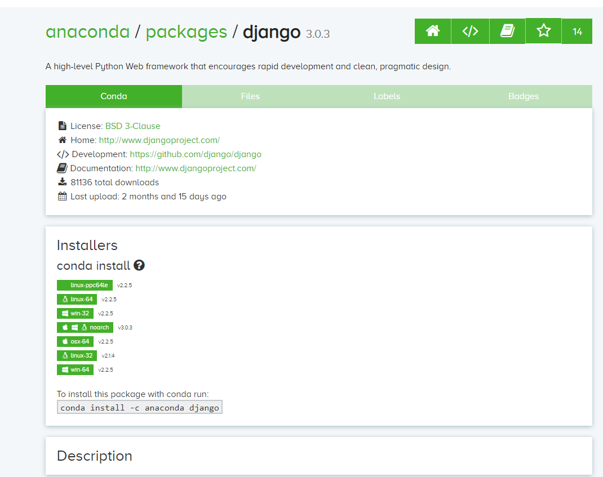
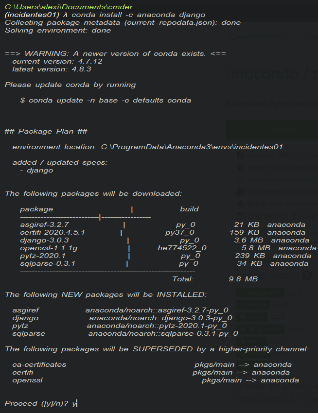
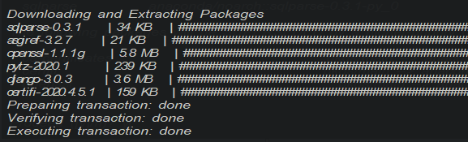
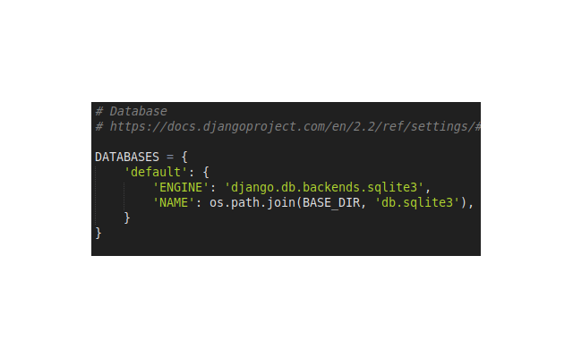

## Creación de proyecto ## 
Una vez que hemos creado y activado nuestro entorno, enseñaremos a instalar django.  
Debemos abrir google en el navegador y escribir lo de la imagen en el buscador:  

<p align="center"> 

</p>   
Abrimos la página de anaconda.org donde veremos lo siguiente: 

<p align="center"> 

</p>

En nuestra terminal debemos hacerlo de la siguiente forma:  

<p align="center"> 

</p>  
Por último si todo salio correctamente deberá verse de la siguiente forma  


<p align="center"> 

</p>  

Ahora, con ésto podemos proceder a crear nuestro proyecto de Django para ello nos paramos en una carpeta donde queramos guardar el proyecto en la terminal y ejecutamos el comando:  
<p align="center">
	
**django-admin startproject prueba**  
</p>
<p align="center"> 

</p> 

Se generará una carpeta con el nombres del proyecto y al abrirla encontraremos la siguiente estructura:  


```
Geodjango_charts/
└── prueba/  
	└── manage.py   
	└── prueba/  
```  

De ésta forma tendremos iniciado nuestro proyecto, ahora deberemos crear nuestra app de la siguiente forma:  
**python manage.py startapp app**  
Así habremos creado nuestra primera app, entremos a la carpeta y crearemos una carpeta dentro llamada vistaPrincipal y moveremos todos los archivos dentro de app a ella.  
La estructura debería quedar de la siguiente forma:  


```
Geodjango_charts/
└── prueba/
   ├── manage.py
   ├── app/
       └── vistaPrincipal/
       		└── migrations/
       		└── admin.py
       		└── app.py
       		└── models.py
       		└── tests.py
       		└── views.py
       └── __init__.py
   ├── prueba/
       └── __init__.py
       └── __pycache__
       └── settings.py
       └── urls.py
       └── wsgi.py
```    

## Configuración del proyecto ##  
Hasta éste punto habremos creado nuestra app ahora debemos realizar unas pequeñas configuraciones en el archivo **settings.py** con el fin de tener la configuración lista para nuestra app.  
Abrimos el archivo settings.py y buscamos la sección de installed apps  
<p align="center"> 

</p> 

Dado que estaremos trabajando con datos espaciales, tendremos que usar la extensión espacial de **django** la cual se puede consultar en el siguiente link **https://docs.djangoproject.com/en/3.0/ref/contrib/gis/**  
<p align="center"> 

</p>

Con ésto estamos usando la extensión espacial y de paso incorporando la herramienta de leaflet para django, leaflet es una herramienta de **Javascript** para la creación de mapas interactivos, se puede encontrar su documentación en el siguiente link **https://leafletjs.com/reference-1.6.0.html**.

**Nota** Se pueden agregar tantas apps queramos crear, solo debemos agregarla dentro de installed apps como le hicimos con la de **app**.

Una vez hecho lo anterior procedemos a indicar la ubicación de la carpeta donde estará nuestros templates de html por lo que la parte de templates deberá quedar de la siguiente forma:  

<p align="center"> 

</p>  
<p align="center"> 

</p> 
Como paso previo deberemos haber creado una base de datos en posgtres y crear la extensión espacial de postgis en ella, no importa que aun no tenga tablas.  
Procedemos a configurar la base de datos dado que por defecto django usa sqlite3 por lo que la configuración debe quedar de la siguiente forma:  

<p align="center"> 

</p>
<p align="center"> 

</p> 
A nuestra base de datos la llamaremos accidentes, pueden usar el nombre que quieran pero debe coincidir con el nombre de la base que crearon al igual que la contraseña.

Como requisito debemos instalar psycopg2 o tenerlo instalado, éste es el controlador para realizar la conexión a Postgres, recordemos que todo debe instalarse en el entorno de conda y através de **conda install package** al igual que hicimos con Django en conda.  
Ahora solo nos queda configurar para poder cargar archivos estáticos, es decir archivos js, img, css que vamos  a requerir más adelante.  

<p align="center"> 

</p> 

Con ésto tenemos la configuración básica de nuestra aplicación hecha, aunque aún podemos modificarle cosas se dejará para más adelante.

Antes de continuar es importante mencionar el concepto de **json y geojson**  
**Json** por sus siglas JavaScript Object Notation (notación de objetos javascritp) y siendo **Geojson** un tipo de json particular para datos espaciales, para más información consultar **https://www.json.org/json-es.html**
