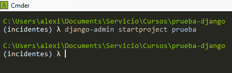

#Introducción:  
Django es un framework de aplicaciones web  de código abierto para el lenguaje  Python, dada la tendencia actual Python empieza a ser uno de los lenguajes mas usados hoy en día, la tendencia va la alza por su facilidad de entendimiento y la comunidad del lenguaje.  

##Objetivo  
El objetivo de éste curso es aprender a montar una aplicación web con dejango y  las herramientas Leaflet y ChartJs.  
##Activación del proyecto  
**conda activate entorno**  
##Creación de proyecto  
**django-admin startproject prueba**  
.  

