# Introducción: #  
Django es un framework de aplicaciones web  de código abierto para el lenguaje  Python, dada la tendencia actual Python empieza a ser uno de los lenguajes mas usados hoy en día, la tendencia va la alza por su facilidad de entendimiento y la comunidad del lenguaje.  

## Objetivo ##  
El objetivo de éste curso es aprender a montar una aplicación web con Django y  las herramientas Leaflet y ChartJs.  
## Activación del proyecto ##  
**conda activate entorno**  
## Creación de proyecto ## 
**django-admin startproject prueba**  
.  
<p align="center"> 

</p>   
Se generará una carpeta con el nombres del proyecto y al abrirla encontraremos la siguiente estructura:  
.  

```
Geodjango_charts/
└── prueba/  
	└── manage.py   
	└── prueba/  
```  

De ésta forma tendremos iniciado nuestro proyecto, ahora deberemos crear nuestra app de la siguiente forma:  
**python manage.py startapp app**  
Así habremos creado nuestra primera app, entremos a la carpeta y crearemos una carpeta dentro llamada vistaPrincipal y moveremos todos los archivos dentro de app a ella.  
La estructura debería quedar de la siguiente forma:  
.  

```
Geodjango_charts/
└── prueba/
   ├── manage.py
   ├── app/
       └── vistaPrincipal/
       		└── migrations/
       		└── admin.py
       		└── app.py
       		└── models.py
       		└── tests.py
       		└── views.py
       └── __init__.py
   ├── prueba/
       └── __init__.py
       └── __pycache__
       └── settings.py
       └── urls.py
       └── wsgi.py
```    

## Configuración del proyecto ##  
Hasta éste punto habremos creado nuestra app ahora debemos realizar unas pequeñas configuraciones en el archivo **settings.py** con el fin de tener la configuración lista para nuestra app.  
Abrimos el archivo settings.py y buscamos la sección de installed apps  
<p align="center"> 
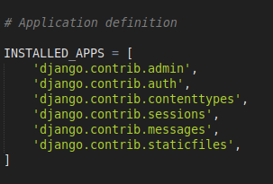
</p> 

Dado que estaremos trabajando con datos espaciales, tendremos que usar la extensión espacial de **django** la cual se puede consultar en el siguiente link ** https://docs.djangoproject.com/en/3.0/ref/contrib/gis/ **  
<p align="center"> 
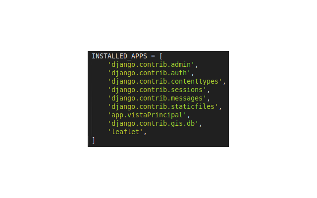
</p>  
Con ésto estamos usando la extensión espacial y de paso incorporando la herramienta de leaflet para django, leaflet es una herramienta de **Javascript** para la creación de mapas interactivos, se puede encontrar su documentación en el siguiente link **https://leafletjs.com/reference-1.6.0.html**.
**Nota** Se pueden agregar tantas apps queramos crear, solo debemos agregarla dentro de installed apps como le hicimos con la de **app**.
Una vez hecho lo anterior procedemos a indicar la ubicación de la carpeta donde estará nuestros templates de html por lo que la parte de templates deberá quedar de la siguiente forma:  

<p align="center"> 
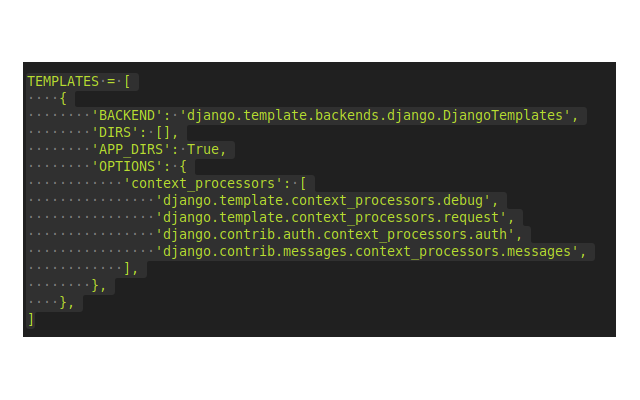
</p>  
<p align="center"> 
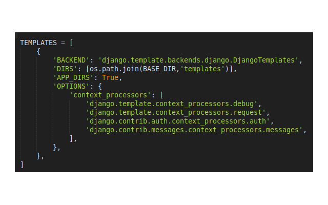
</p> 
Como paso previo deberemos haber creado una base de datos en posgtres y crear la extensión espacial de postgis en ella, no importa que aun no tenga tablas.  
Procedemos a configurar la base de datos dado que por defecto django usa sqlite3 por lo que la configuración debe quedar de la siguiente forma:  

<p align="center"> 
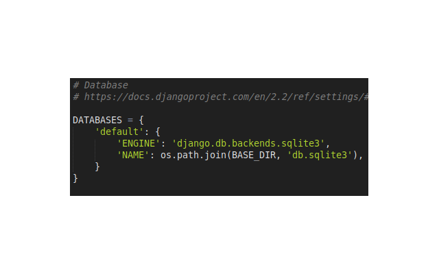
</p>
<p align="center"> 
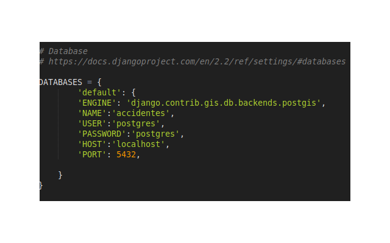
</p> 
A nuestra base de datos la llamaremos accidentes, pueden usar el nombre que quieran pero debe coincidir con el nombre de la base que crearon al igual que la contraseña.  
Como requisito debemos instalar psycopg2 o tenerlo instalado, éste es el controlador para realizar la conexión a Postgres, recordemos que todo debe instalarse en el entorno de conda y através de **conda install package**.  
Ahora solo nos queda configurar para poder cargar archivos estáticos, es decir archivos js, img, css que vamos  a requerir más adelante.  

<p align="center"> 
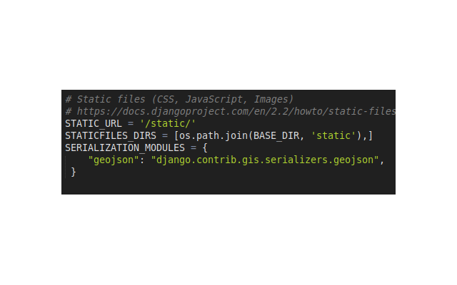
</p> 

Con ésto tenemos la configuración básica de nuestra aplicación hecha, aunque aún podemos modificarle cosas se dejará para más adelante.

Antes de continuar es importante mencionar el concepto de **json y geojson**  
**Json** por sus siglas JavaScript Object Notation (notación de objetos javascritp) y siendo ** Geojson ** un tipo de json particular para datos espaciales, para más información consultar **https://www.json.org/json-es.html**  

## ¿Qué son los modelos django ##
Introduciremos el concepto de ORM (Object Relational Mapping) Objecto Modelo Relación en español, es un patrón de diseño que nos permite manejar las tablas de la base de datos como clases en el lenguaje, en nuestro caso Python, django internamente maneja un mapeo entre nuestras tablas en la base de datos y clases en python, es importante que la manupulación hacia las tablas de la base de datos es mejor hacerlo através del ORM que con ejecución de querys directamente a la base de datos por temas de seguridad.
<p align="center"> 

</p> 
###Cómo definir modelos en  python###
Debemos irnos al archivo models.py dentro de app y veremos lo siguiente:  
<p align="center"> 
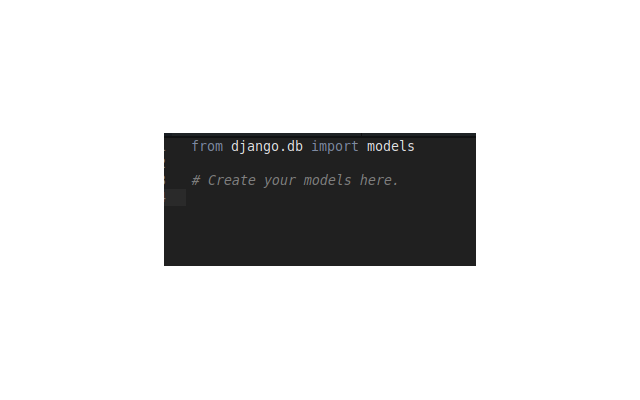
</p>   
Aquí debemos definir nuestros mapeos de la base de datos como se mencionó anteriormente, para crear un modelo que tenga soporte para datos espaciales debemos primero hacer el siguiente **import** hasta arriba de nuestro archivo

```python
from django.contrib.gis.db import models as geomodels
```  
con ello estaremos diciéndole a django que use la extensión espacial y podemos definir nuestros modelos de la siguiente forma, haremos una clase ejemplo  

```python
from django.db import models
from django.contrib.gis.db import models as geomodels

# Create your models here.

class Datos(models.Model):
    id = models.IntegerField(primary_key=True)    	
    geom = geomodels.MultiPointField()
    field_1	= models.IntegerField()
    id_ssc	= models.IntegerField()
    id_pgj = models.IntegerField()
    delito = models.CharField(max_length = 100)
    tipo_evento = models.CharField(max_length = 100)
    fecha = models.DateTimeField()	
    identidad = models.CharField(max_length = 100)	
```  
Como podremos observar nuestra variable id de tipo entero será nuestra llave en la tabla, posteriormente lo más importante a notar es la variable geom la cual funge como la representación de la geometría en nuestro caso es de tipo punto aunque podríamos tener otras como poligono o línea. Es **recomendable** más no obligatorio que se defina el modelo para cada app en su propio models.py
Aunque resulte un poco obvio que IntegerField() y CharField() sean para campos de tipo entero y cadena respectivamente, no está de más leer o tener a la mano la documentación **https://docs.djangoproject.com/en/3.0/ref/contrib/gis/model-api/**, **https://docs.djangoproject.com/en/3.0/topics/db/models/**.  
Dejaremos pendientes la parte de las relaciones entre tablas para más adelante, de momento no son necesarias..

## Rutas **URL** y vistas ##  
Para ésto es importante mencionar qué es HTTP (Protocolo de Transferencia de Hipertexto), es un protocolo de transferencia de información hipermedia para Internet, diseñado para la comunicación entre navegadores y servidores web, como lo que estaremos montando es un servidor web.  
Nos iremos al archivo **views.py** dentro de app por lo que tendremos el siguiente código:  
```python
from django.shortcuts import render

# Create your views here.
```  
Importaremos las siguientes bibliotecas:  
```python
from django.shortcuts import render
import json
from geojson import Point, Feature, FeatureCollection, dump


from django.contrib.gis.geos import Polygon, Point, MultiPoint, GeometryCollection
from shapely.geometry import Point, mapping, shape
from .models import * 
from django.views.decorators.csrf import csrf_exempt

from django.http import *

from django.core.serializers import serialize
from django.core  import *
#Create your views here
```  
Entonces definiremos nuestra ruta para el index, el cual siempre funge como la página principal para ésto mencionaremos brevemente los dos métodos **HTTP** más comunes:  
*   GET El método GET  solicita una representación de un recurso específico. Las peticiones que usan el método GET sólo deben recuperar datos.    
*   POST  El método POST se utiliza para enviar una entidad a un recurso en específico, causando a menudo un cambio en el estado o efectos secundarios en el servidor.    

Procedemos a definir el index (home) de la siguiente manera:
```python
@csrf_exempt

def index(request):
    if request.method == 'GET':
        return render(request,'primeraVista/home.html')
    elif request.method == 'POST':
        
        return HttpResponseForbidden()
```  
De momento no necesitamos definir un comportamiento para el método POST hacia nuestro index por lo que  usamos 403 de http para denegar la petición, solo nos interesa mandar peticiones de tipo GET al servidor para renderizar el html de la página principal, aunque la convención es a la primera vista llamarla **index.html**, posteriormente debemos ir a nuestro archivo **urls.py** dentro de la carpeta prueba y deberá verse de la siguiente forma:  
<p align="center"> 
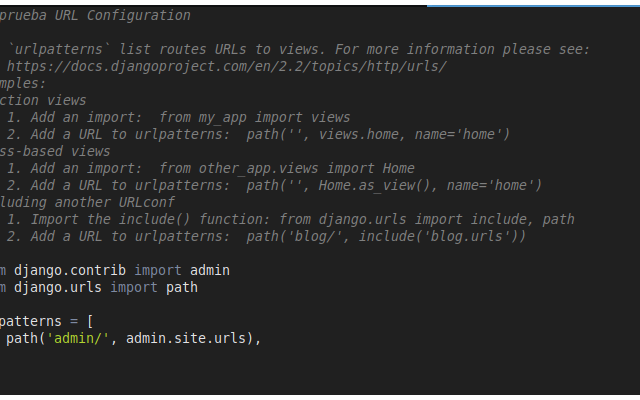
</p>  

Como podremos observar solo tenemos la ruta para el admin propio de django, ahora en éste arreglo debemos definir la ruta para cada ruta que tengamos en nuestro servidor django, de 
momento solo tendremos la que contendrá el mapa en leaflet, por lo que deberemos tener el siguiente código en nuestro archivo **prueba/urls.py**:

```python
from django.contrib import admin
from django.urls import path
from django.conf.urls import url ,include
from app.vistaPrincipal.urls import *
urlpatterns = [
    path('admin/', admin.site.urls),
    path('', include('app.vistaPrincipal.urls')),
]
```
Y crearemos un nuevo archivo **urls.py** dentro de la carpeta vistaPrincipal con el siguiente contenido:

```python
from django.urls import path
from django.conf.urls import url,include
from app.vistaPrincipal.views import *
urlpatterns = [
    path('',index),
]
```  
Entre las comillas debemos escribir la ruta que deberá tomar, cuando dejamos las comillas en vacío le estamos indicando que la ruta por defecto es "http://127.0.0.1:8000".  

### Nota con las rutas  
Es posible definir varios archivos  de rutas, podríamos definir para cada módulo de nuestra aplicación un **urlpattern** para manejar las vistas correspondientes,  
Previo a iniciar por primera vez nuestro servidor debemos aplicar las **migrations** las cuales son la forma en la que django aplica los cambios a los modelos definidos y con el comando **makemigrations** se crean nuevas migraciones sobre la base de datos, es por ello que deberemos ejecutar los siguientes comandos:  
**python manage.py migrate**
<p align="center"> 
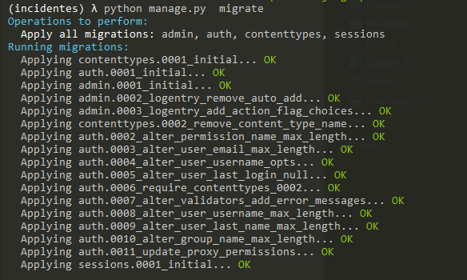
</p>  

**python** **manage.py** **makemigrations**    

<p align="center"> 
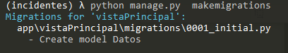
</p> 

Ahora si podremos inicar nuestra aplicación para comprobar si todo va correctamente, ejecutaremos el comando **python** **manage.py** **runserver** y si vamos a nuestro navegador con la ruta "http://127.0.0.1:8000" obtendremos lo siguiente:  
<p align="center"> 

</p>  


## Creación de nuestro archivo home.html
Debemos crear las carpetas static y templates por convención se deben usar esos nombres, con lo cual nuestro proyecto debe tener la siguiente estructura:  
```
Geodjango_charts/
└── prueba/
   ├── manage.py
   ├── app/
       └── vistaPrincipal/
       		└── migrations/
       		└── admin.py
       		└── app.py
       		└── models.py
       		└── tests.py
       		└── views.py
       		└── urls.py
       └── __init__.py
   ├── prueba/
       └── __init__.py
       └── __pycache__
       └── settings.py
       └── urls.py
       └── wsgi.py
    ├── templates/
    	└── primeraVista
    		└──home.html
    ├── static/
    	└── img/
    	└── js/
    	└── css/
```
agregar lo de app.vistaPrincipal.url  
Ahora dentro de la carpeta templates/primeraVista creamos un archivo **home.html** con la siguiente estructura básica de html5  

<p align="center"> 
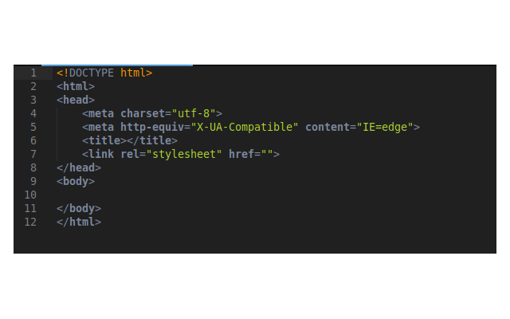
</p>  

En donde **head** es donde haremos todos los imports de las bibliotecas externas y archivos css.
Con lo que ahora podremos visualizar lo siguiente en nuestro navegador:  

<p align="center"> 
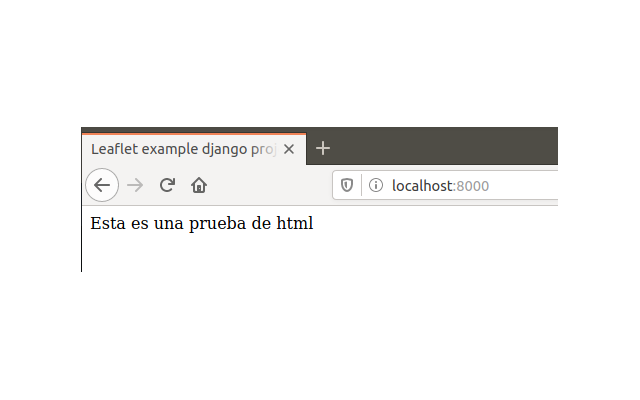
</p>

Debemos escribir hasta arriba de nuestro html lo siguiente:  

<p align="center"> 
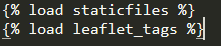
</p> 

**Hasta éste punto ya tenemos nuestro template listo para montar nuestro mapa** por lo que procedemos a importar leaflet, pero antes haremos el import de las cosas necesarias externas y otros tags para leaflet:  

<p align="center"> 
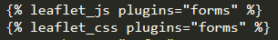
</p>  

```html
    <link href="https://fonts.googleapis.com/css?family=PT+Sans&display=swap" rel="stylesheet">
    <link href="https://fonts.googleapis.com/css?family=Bebas+Neue&display=swap" rel="stylesheet">
    <link href="https://fonts.googleapis.com/css?family=Encode+Sans+Semi+Condensed|IBM+Plex+Mono|PT+Sans|Titillium+Web&display=swap" rel="stylesheet">
      
    <!--JQuery-->
    <script src="https://ajax.googleapis.com/ajax/libs/jquery/3.2.1/jquery.min.js"></script>
    
    <!--Fonts necesarios-->
    <link href="https://fonts.googleapis.com/css?family=PT+Sans&display=swap" rel="stylesheet">
    <link href="https://fonts.googleapis.com/css?family=Bebas+Neue&display=swap" rel="stylesheet">
    <link href="https://fonts.googleapis.com/css?family=Indie+Flower|Open+Sans|Open+Sans+Condensed:300|Raleway|Roboto+Mono|Roboto+Slab&display=swap" rel="stylesheet">
    <link href="https://fonts.googleapis.com/css?family=Encode+Sans+Semi+Condensed|IBM+Plex+Mono|PT+Sans|Titillium+Web&display=swap" rel="stylesheet">
    <!-- Scripts necesarios para chart js-->
    <script src="https://cdnjs.cloudflare.com/ajax/libs/Chart.js/2.7.2/Chart.bundle.js" integrity="sha256-JG6hsuMjFnQ2spWq0UiaDRJBaarzhFbUxiUTxQDA9Lk=" crossorigin="anonymous"></script>
    <script src="https://cdnjs.cloudflare.com/ajax/libs/Chart.js/2.7.2/Chart.bundle.min.js" integrity="sha256-XF29CBwU1MWLaGEnsELogU6Y6rcc5nCkhhx89nFMIDQ=" crossorigin="anonymous"></script>
    <script src="https://cdnjs.cloudflare.com/ajax/libs/Chart.js/2.7.2/Chart.js" integrity="sha256-J2sc79NPV/osLcIpzL3K8uJyAD7T5gaEFKlLDM18oxY=" crossorigin="anonymous"></script>
    <script src="https://cdnjs.cloudflare.com/ajax/libs/Chart.js/2.7.2/Chart.min.js" integrity="sha256-CfcERD4Ov4+lKbWbYqXD6aFM9M51gN4GUEtDhkWABMo=" crossorigin="anonymous"></script>
    
```  

Ahora necesitamos agregar nuestros propios archivos así que haremos los siguientes imports:  

<p align="center"> 
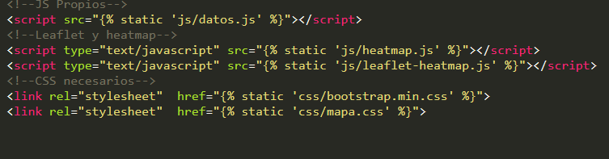
</p>  

De momento no nos meteremos con css por lo que tendremos una estructura básica para un mejor entendimiento  del curso, por lo que quedarían de la siguiente forma y explicaremos cada uno de ellos:  
```html  
<div class="Instrucciones">
            <h2>INSTRUCCIONES</h2>
            <p> En el mapa se observan de color rojo las zonas con mayor
              densidad de incidentes viales fatales para el año 2019 en la Ciudad de México. 
              Al seleccionar un mes es posible identificar su variación temporal. Además de la descripción del suceso.
            </p>     
        </div>
        <!--Un botón para -->

        <div class='select'>
          <select name="combo-box" id="combo-box">
            <option value="2018">AÑO 2018</option>
            <option value="Enero">Enero</option>
            <option value="Febrero">Febrero</option>
            <option value="Marzo">Marzo</option>
            <option value="Abril">Abril</option>
            <option value="Mayo">Mayo</option>
            <option value="Junio">Junio</option>
            <option value="Junio">Julio</option>
            <option value="Agosto">Agosto</option>
            <option value="Septiembre">Septiembre</option>
            <option value="Octubre">Octubre</option>
            <option value="Noviembre">Noviembre</option>
            <option value="Diciembre">Diciembre</option>
          </select> 
        </div>

      <div class ='button-div'> 
          <button class="button" type="submit" onclick="mapaCalor()" >ACEPTAR</button>
      </div>

      
      <div class ='mapa'>
            <div class="item1" id="map1" style="min-zoom: 3;"></div>    
      </div>
      <div class="chart-container" >
        <canvas id="myChartGraph" width="100" height="100" style="margin-left:100px;"></canvas> 
        <canvas id="myChartGraph1" width="100" height="100" style="margin-left:200px;"></canvas> 

       </div> 


```  
Ahora en nuestro archivo **mapa.css** solo debemos tener lo siguiente:  

```css
.item1{
  height:500px;
  width:50%;
}
```  

El tag **select** nos sirve para desplegar un **combo-box** al cual através de **id** le asignamos un identificador para trabajar con él más adelante y lo llenamos con los valores que en nuestro caso nos conviene alberguen los meses del año y opciones adicionales y através del tag **option** podemos meter las opciones al combo-box, **value** le asigna un valor de tipo cadena el cual es el que lograremos obtener desde JavaScript para saber cuál fue la selección del usuario.  
En el tag **button** le  estamos indicando que cuando sea apretado ejecute una llamada a función en nuestro caso le llamaremos mapaCalor(), así también le pondremos el mensaje de Aceptar para que el usuario después de seleccionar el mes que desea pueda filtrar los datos.  
Debemos crear un div exclusivo para nuestro mapa de leaflet, le asignaremos el **id="map1"** y la clase de css **class="item3"**, se podría decir que solo estamos definiendo el contenedor para el mapa de momento y dejaremos pendiente las gráficas para más adelante en el curso.  

Creamos un nuevo archivo llamado mapa.css y lo guardaremos dentro de la carpeta **static/css/** para más adelante poder acomodar nuestros elementos, así también copiaremos los archivos heatmat.js y leaflet-heatmap.js dentro de nuestra carpeta **static/js/** y también crearemos dentro de dicha carpeta un archivo **datos.js** con lo que nuestra estructura actualizada quedaría de la siguiente manera:  

```
Geodjango_charts/
└── prueba/
   ├── manage.py
   ├── app/
       └── vistaPrincipal/
          └── migrations/
          └── admin.py
          └── app.py
          └── models.py
          └── tests.py
          └── views.py
          └── urls.py
       └── __init__.py
   ├── prueba/
       └── __init__.py
       └── __pycache__
       └── settings.py
       └── urls.py
       └── wsgi.py
    ├── templates/
      └── primeraVista
        └──home.html
    ├── static/
      └── img/
      └── js/
        └──datos.js
        └──heatmap.js
        └──leaflet-heatmap.js
      └── css/
        └──mapa.css
```  
**Nota**, los archivos los puedes encontrar el la carpeta js del tutorial  
<p align="center"> 
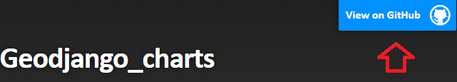
</p>  

Hasta el momento si revisamos nuestra página observaremos lo siguiente:
<p align="center"> 
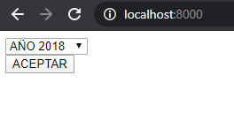
</p>  

Aun no lo hemos dado estilo pero tenemos los elementos que necesitamos, dejaremos un poco de lado el estilo de momento y procederemos a programar en JavaScript el mapa de leaflet.  
Daremos una breve introducción a **JQuery y Ajax** que son frameworks o marcos de trabajo de Javascritp que usaremos en breve.

## JQuery y Ajax

**JQuery** **https://jquery.com/** es una biblioteca que nos permite manipular el HTML, el manejo de eventos, manejo de AJAX, animaciones entre otras muchas cosas, al igual que muchos otros frameworks facilitan las formas de programar en javascript.

**Ajax**  significa JavaScript asíncrono y XML (AJAX significa JavaScript asíncrono y XML), es un conjunto de técnicas usadas en el desarrollo web que permiten a las aplicaciones funcionar de forma asíncrona, ésto es que no se tenga que esperar a recibir respuesta del servidor para continuar la ejecución, se procesan las solicitudes en segundo plano.

Ahora que al menos sabemos qué es cada cosa, podemos abrir el archivo **datos.js**, haremos una prueba para cargar los datos en cuanto nuestra página se cargue a su totalidad, para ello usaremos una función muy útil de Jquery la cual es:    

```text
$(document).ready(function{...});
```

Donde function es donde definiremos el comportamiento de esa función anónima, recordemos que JavaScript permite el paso de funciones como parámetros, lo cual nos será útil más adelante, ahora dentro de ésta función debemos definir lo siguiente:  

```javascript
var testData = {
        data: []
    };
```
La variable testData es un objeto el cual tiene un atributo data de tipo array que de momento dejaremos vacio, posteriormente deberemos crear e instanciar el primer layer del mapa, un layer es una capa que podemos agregar a nuestro mapa de leaflet, recordando que podemos tener varias capas en un mapa, entonces el código quedaría de la siguiente forma: 

```javascript
 var baseLayer = L.tileLayer('https://tiles.wmflabs.org/hikebike/{z}/{x}/{y}.png', {
        Zoom: 9,
        attribution: '&copy; <a href="https://www.openstreetmap.org/copyright">OpenStreetMap</a> contributors'
      });
```  
Donde zoom es una opción que le podemos cambiar al métodod TileLayer de leaflet **puede consultar el siguiente link para más información** **https://leafletjs.com/reference-1.6.0.html#tilelayer**, TileLayer por su parte nos permita para cargar y mostrar capas en nuestro mapa, el primero parámetro del método corresponde al template del mapa (los cuales puede cambiar a consideración dependiendo el uso) se pueden encontrar algunos en el siguiente link **https://wiki.openstreetmap.org/wiki/Tile_servers**, el siguiente parámetro es un objeto con opciones para nuestro mapa, puede consultar las opciones aquí o puede dirigirse a link que se puso previamente, de momento nos quedaremos solo con zoom y attribution para dar crédito a OpenStreetMaps

<p align="center"> 
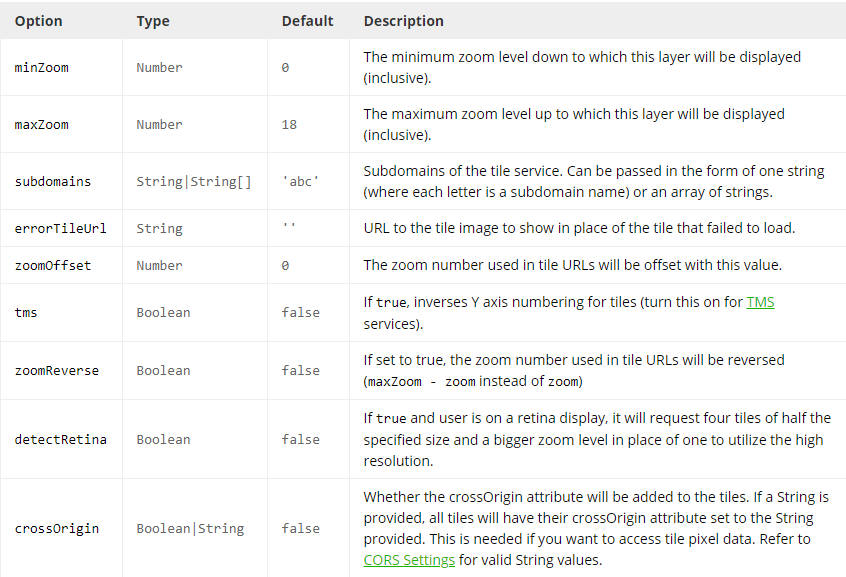
</p> 

Ahora procederemos a asignar el objeto de configuración a la variable **cfg** de la siguiente forma:   
```javascript
 var cfg = {
        // radius should be small ONLY if scaleRadius is true (or small radius is intended)
        // if scaleRadius is false it will be the constant radius used in pixels
        "radius": .008,
        "maxOpacity": .5,
        "gradient": {
          '0': 'Navy', '0.25': 'Navy',
          '0.26': 'Green',
          '0.5': 'Green',
          '0.51': 'Yellow',
          '0.75': 'Yellow',
          '0.76': 'Red',
          '1': 'Red'
        },
        // scales the radius based on map zoom
        "scaleRadius": true,
        // if set to false the heatmap uses the global maximum for colorization
        // if activated: uses the data maximum within the current map boundaries
        //   (there will always be a red spot with useLocalExtremas true)
        "useLocalExtrema": true,
        // which field name in your data represents the latitude - default "lat"
        latField: 'lat',
        // which field name in your data represents the longitude - default "lng"
        lngField: 'lng',
        // which field name in your data represents the data value - default "value"

      };
```  
Donde el campo **radius** indicará el radio de nuestro punto en el mapa, **maxOpacity** la opacidad del punto, en el objeto **gradient** la escala de colores, **scaleRadius** le indica que el punto se reescala conforme alejas el zoom en el mapa, **latfield** le indicará qué campo deberá tomar de los datos que le pasemos para la latitud, por otro lado **lngField** es para la longitud.  
Para crear nuestra capa de mapa de calor instanciamos e inicializamos la instancia con ayuda de la clase **HeatMapLayer** de la siguiente forma:  

```javascript
heatmapLayer = new HeatmapOverlay(cfg);  
```  
 
A continuación debemos inicilizar el mapa con ambas capas, **baseLayer** nos proporciona la capa que contiene el **tile server** y heatmap contiene la representación de los mapas de calor entonces procedemos a escribir el siguiente código:  

```javascript
map1 = new L.Map('map1', {
        zoomControl: true,
        minZoom: 11,
        maxZoom: 20,
        layers: [baseLayer, heatmapLayer],
        zoomAnimation: true,
        keyboard: true
      }).setView([19.40, -99.14], 11);
```

Donde el campo **zoomControl** recibe un valor booleano para indicar si se puede acercar o alejar el zoom con la rueda del ratón, **minZoom** es el mínimo zoom que puede tener el mapa y **maxZoom** es el máximo zoom que puede tener, **layers** es probablemente el campo de configuración más importante porque aquí le indicamos las capas que debe tener nuestro mapa, por lo que debe incluir la capa con los datos para el mapa de calor y el mapa base, existen otras opciones que podemos incluir en nuestro mapa las cuales se pueden consultar en el siguiente link https://leafletjs.com/reference-1.6.0.html#map-option  

Nuestra página debería verse de la siguiente forma:    
<p align="center"> 
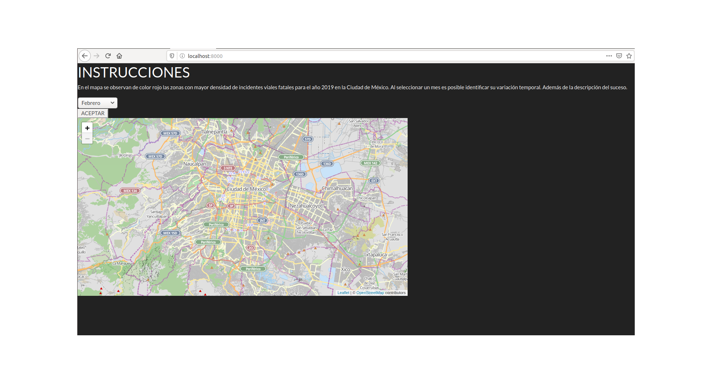
</p> 

Ahora implementaré una solución (no única) para que por defecto, al cargar o recargar la página, se jalen todos los datos de la base y después através del combo-box podamos filtrar los datos, de momento la implementación para cargar por defecto todos los datos con python y js sería de la siguiente forma (explicaremos paso a paso):

```javascript
map1 = new L.Map('map1', {
        zoomControl: true,
        minZoom: 11,
        maxZoom: 20,
        layers: [baseLayer, heatmapLayer],
        zoomAnimation: true,
        keyboard: true
      }).setView([19.40, -99.14], 11);
```
Primero programaremos toda la parte de Javascript  

```javascript
$.ajax({
        type: "GET",
        url: 'data/',
        data: {
          'val': '2018'
        },
        dataType: 'json', 
        async: true,

        ...});
```
Iniciamos una petición de ajax con jquery, le definimos el método http que usaremos, en nuestro caso nos interesa obtener información del servidor, por lo que el método ideal es **GET**, le pasamos el url al que debe hacer la petición en nuestro caso **data/**, le indicamos que el tipo de dato que queremos es un **JSON** y la petición que sea asíncrona, es decir que si le es posible continue con la ejecución mientras espera la respuesta del servidor ésto es por temas de experiencia de usuario.  
Ahora que logramos hacer nuestra petición debemos usar lo que se conoce como **promesas** de js, ésto podemos verlo como un objeto que representa éxito o fracaso en la petición asíncrona que hemos realizado con ajax, siempre se ejecutan terminando las funciones anteriores, entonces si todo sale bien y recibimos los datos usaremos una promesa para manejar la respuesta del servidor que debiera ser un objeto JSON.  
La sintaxis es la siguiente:  
```javascript
$.ajax({
        ...

        success:function(respuesta){
          //Uso de respuesta  
        }
});
```

Solo para un mejor entendimiento voy a aclarar, directamente podríamos pasar el json como los datos para el mapa pero en particular nos interesa filtrar algunos campos por ende será un poco repetitivo y antes iremos a python a programar la parte del backend donde se procesará la petición, por lo que abriremos nuevamente el archivo **app/vistaPrincipal/views.py**

```python
    #código previo
@csrf_exempt
def data(request):
    if request.method == 'GET':
        val = request.GET.get('val')
        #podemos imprimir el valor para debug solamente, en producción por buenas prácticas de programación no hay que dejar print's 
        print(val)
        if(val != "2018"):    
            dataAux = serializers.serialize("geojson", Datos.objects.filter(fecha__month=val))
            return  HttpResponse(dataAux)
        else:
            dataAux = serializers.serialize("geojson", Datos.objects.all())
            return  HttpResponse(dataAux)
    elif request.method == 'POST':
        return HttpResponseForbidden()
```  

Como podremos observar, solo estaremos permitiendo peticiones de tipo **GET** dado que no tiene sentido recibir **POST**, el usuario solo quiere consultar datos, por tanto no modificar el estado del servidor, así que usamos 403 de HTTP forbidden como lo podemos ver en el código de arriba. Ahora bien, la lógica nos lleva a dos casos, si el valor buscado por el usuario corresponde a **2018** u otro caso, por ejemplo, **Enero** independientemente del valor, lo único que hay que hacer es un query a la base de datos pero por temas de seguridad se recomienda hacerlo através del ORM y no de ejecuciones directas, ésto con el fin de evitar **SQLInjection**. 

```python
            #... 
            dataAux = serializers.serialize("geojson", Datos.objects.filter(fecha__month=val))
            return  HttpResponse(dataAux)
            # else:
            dataAux = serializers.serialize("geojson", Datos.objects.all())
            return  HttpResponse(dataAux)
```

La sintaxis es Modelo.objects.metodo(parametros), para el primer caso como nos interesa consultar los datos de un determinado mes, debemos aplicar un filtro con .filter() y los parámetros deben corresponder a los atributos de la tabla en la base de datos, en nuestro caso es fecha (el cual es el atributo de tipo date en django) es un equivalente a hacer ésto en postgres:  


```sql
---dataAux = serializers.serialize("geojson", Datos.objects.filter(fecha__month=val))

select * from "vistaPrincipal_datos" where date_part('month', fecha) = mesFiltrado;
```
Y por otro lado el equivalente al caso 2 sería el siguiente:  

```sql
---dataAux = serializers.serialize("geojson", Datos.objects.all())
select * from "vistaPrincipal_datos";
```
Cuando obtenemos los datos ahora hay que serializarlos, para ésto nos axiliaremos de la clase serializer de django  **https://docs.djangoproject.com/en/3.0/ref/contrib/gis/serializers/** donde el primer parámetro indica a qué tipo de formato queremos serializar, en nuestro caso es json (o geojson en particular). Una vez teniendo serializando los datos debemos regresarlos a JavaScript para que pueda seguir con la ejecución.

```javascript
$.ajax({
        ...

        success:function(respuesta){
          responseFeatures = respuesta['features']
        }
});
```
Como nos interesa guardar los datos para las gráficas, aunque no es la única forma de hacerlo guardaremos en arreglos auxiliares, para recorrer el objeto json usaremos la estructura **for-each** de js  


```javascript
$.ajax({
        ...

        success:function(respuesta){
          responseFeatures = respuesta['features']
	  geoms = []
	  props = []
	  element = []
	  responseFeatures.forEach(element => geoms.push(element.geometry) && props.push(element.properties["delito"]) && 
	  entidad.push(element.properties["identidad"]));
        }
});
```
Lo que hicismo fue iterar sobre cada elemento dentro de las responseFeatures del geojson y guardamos en el respectivo arreglolos datos. Ahora, guardaremos las coordenadas de los puntos en otro arreglo
```javascript
$.ajax({
        ...

        success:function(respuesta){
          responseFeatures = respuesta['features']
	  geoms = []
	  props = []
	  element = []
	  responseFeatures.forEach(element => geoms.push(element.geometry) && props.push(element.properties["delito"]) && 
	  entidad.push(element.properties["identidad"]));
	  auxPuntosFinal = []
          geoms.forEach( function(element) {
            auxPuntos = []
            auxPuntos.push(element.coordinates[0][1])
            auxPuntos.push(element.coordinates[0][0])
            auxPuntosFinal.push(auxPuntos)
          });
	  
        }
});
```
Iteramos sobre las geometrías para las coorendas de cada punto y lo guardarmos como sub-arreglos de longitud 2 para posteriormente iterar sobre el arreglo de arreglos resultante y obtener la latitud y longitud  

```javascript
$.ajax({
        ...

        success:function(respuesta){
          responseFeatures = respuesta['features']
	  geoms = []
	  props = []
	  element = []
	  responseFeatures.forEach(element => geoms.push(element.geometry) && props.push(element.properties["delito"]) && 
	  entidad.push(element.properties["identidad"]));
	  auxPuntosFinal = []
          geoms.forEach( function(element) {
            auxPuntos = []
            auxPuntos.push(element.coordinates[0][1])
            auxPuntos.push(element.coordinates[0][0])
            auxPuntosFinal.push(auxPuntos)
          });
	  datos = []
          auxPuntosFinal.forEach( function(element) {
              dataAux = {
                         lat: element[0],
                         lng:element[1]
                       }
              datos.push(dataAux)
          });
	  
        }
});
```
Ahora que tenemos los datos para el mapa de calor (las coordenadas) se las asignaremos a nuestro objeto testData el arreglo datos de la siguiente forma:  


```javascript
$.ajax({
        ...
	varData = datos
        
});
```
Y le asignamos los puntos a nuestro mapa de calor a través del método setData()  
```javascript
$.ajax({
        ...
	heatmapLayer.setData(testData);
        
});
```

Ahora le pasaremos los datos para generar las gráficas, mandamos a llamar la función graficar(a,b) con los siguientes parámetros   

```javascript
$.ajax({
        ...
	 graficar(entidad, props)
        
});
```

Ahora debemos tener lo siguiente en nuestro mapa:  

<p align="center"> 
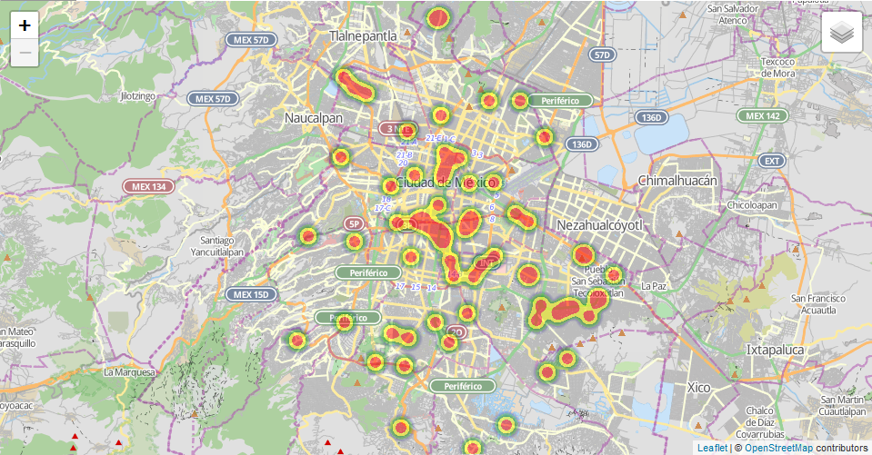
</p>

# Referencias
1.  Mozilla, Mozilla org, Lunes 17 Febrero 2019, HTTP, https://developer.mozilla.org/es/docs/Web/HTTP. 
