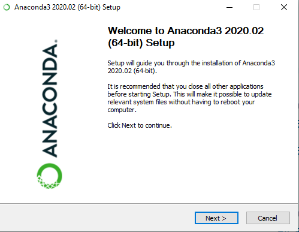
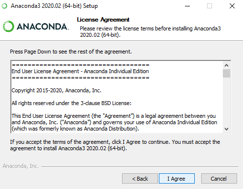
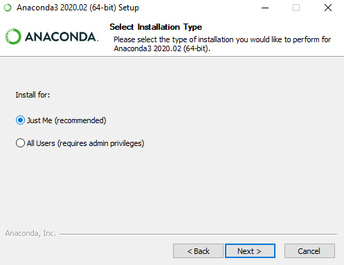
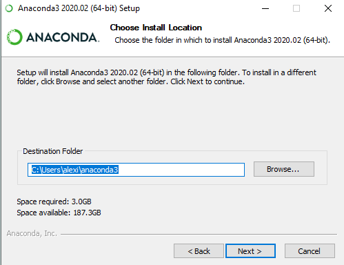
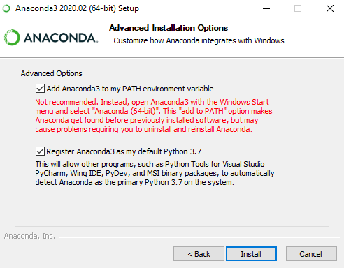
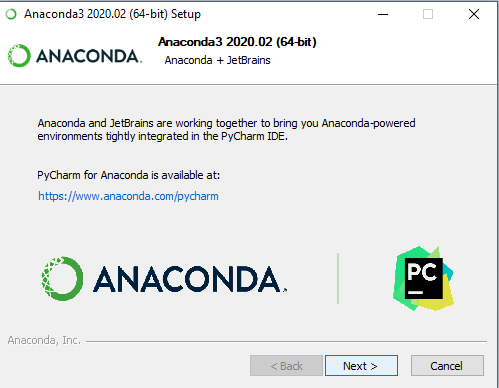
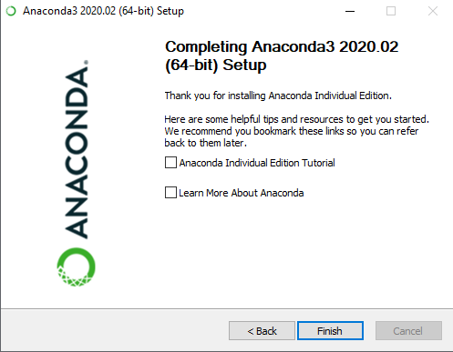
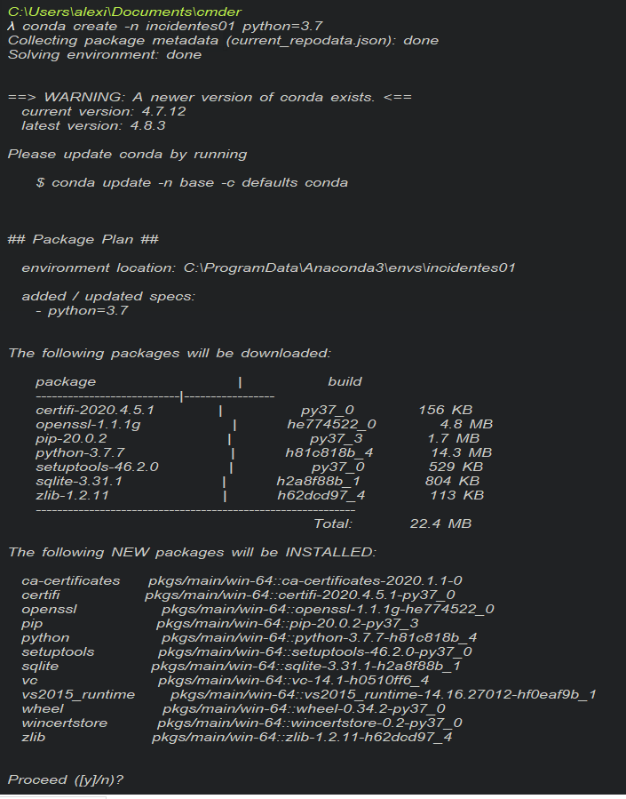

# Introducción: #  
Django es un framework de aplicaciones web  de código abierto para el lenguaje  Python, dada la tendencia actual Python empieza a ser uno de los lenguajes mas usados hoy en día, la tendencia va la alza por su facilidad de entendimiento y la comunidad del lenguaje.  

## Objetivo ##  
El objetivo de éste curso es aprender a montar una aplicación web básica con Django, junto con las herramientas Leaflet y ChartJs.

## Conocimientos previos ##
Se recomienda tener nociones intermedias de python, de lo contrario se recomienda apliamente revisar primero el curso de python básico e intermedio en el siguiente link.

Además, aunque se cubra un poco, se puede encontrar un tutorial básico de Javascript en el siguiente link:
## Instalación de Anaconda en Windows 10 ##  

 

  

**¿Qué es Anaconda?**   
Bueno pues Anaconda es una herramienta desarrollada por **Anaconda, Inc.** para Python y R que nos provee de bibliotecas, aplicaciones y herramientas muy útiles en el campo de la Ciencias de Datos sienod éste de código abierto.

Para descargar Anaconda en windows simplemente debemos ir al siguiente link  **https://www.anaconda.com/products/individual** donde se nos proporciona la edición individual libre de Anaconda. 

 

  

Debemos dar en el botón de download y nos pedirá seleccionar la versión que queramos descargar, en nuestro caso bajaremos la versión de 64 bits con el instalador gráfico   
Abrimos el ejecutable .exe que nos descarga y veremos la siguiente pantalla: 

 

  

 

  

 

  

 

 

 

 
Indicamos la ruta de instalación, recomiendo dejarla tal cual la ponga si no estás familiarizado con las rutas.  

 

  
Aquí debemos seleccionar las dos casillas, la primera lo que hace es agregar una variable de entorno para Anaconda en nuestro sistema operativo, ésto le indica al sistema operativo que independientemente de dónde estemos parados en la terminal podamos **"invocar"** a anaconda.  
Por otro lado, la otra casilla indica que le otorgamos que detecte el python de Anaconda por defecto al sistema operativo, tanto a herramientas como Visual Studio o similar, si no queremos que se use la versión de anaconda por defecto, entonces no debemos marcar esa casilla.  

 

  

 

  

 

Ahora tenemos instalado anaconda en nuestro sistema operativo

## Activación del proyecto ##  
**conda activate entorno**  
## Creación de proyecto ## 
**django-admin startproject prueba**  

 

 
